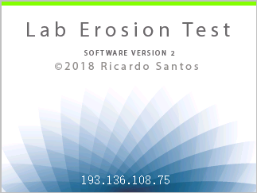

# *LerAS - Ler Acquisition System*
###### **L**aboratory **ER**osion test Acquisition System 

This work has been done by [*Ricardo Correia dos Santos*](https://www.linkedin.com/in/ricardons/) at 
[Laboratório Nacional de Engenharia Civil - *LNEC*](http://www.lnec.pt/en/), in Lisbon, Portugal.

**Website**: https://ricardosgeral.github.io/LerAS/

### About the author and *LerAS* project
I'm a Civil Engineer, with a master degree in Geotechnical Engineering, and a PhD on experimental investigations on 
internal erosion in embankment dams.

Carrying out the laboratory tests on internal erosion in soils, developed in my PhD, 
requires to continually collect different types of measurements (water pressures, flowrate, temperature, 
turbidity, ...).
Most of the measurements were made by hand, at least, by two operators!! 
This manual process is tedious and prone to human errors.

So, I've decided to invest time, and few money, developing a "low budget" acquisition system (hardware and software) that could 
collect data from multiple sensors. 
*LerAS* was born this way!

Please note that I'm not an expert in informatics, computing, nor in electronics.
I define myself as an enthusiastic self learner. 
All shown here was developed from my own research, mainly on forums, Github and other websites.
Thus, it is possible that some things (code, connections,...) could be optimized, or done in a different or better way. 
Yet, the acquisition system performs as intended.
You can report bugs, suggest enhancements, or even fork the project on Github. 
All contributions are welcome.

### Is this for me?
If you need to do a similar project, you just need to have some DIY skills, for scrapping some materials, figuring out 
how to assemble some things together, and figuring out how some components work. The 
instructions given here should also be taken more like guidelines based on what I could do with the materials I had. If 
you do not have the exact same hardware components 
(sensors, ADC, level shifter, touchscreen...), yours will surely work a little different, but as they should do the same 
things, there will be similarities too. In that case, you may have to adjust the code and/or the connections.

Feel free to contact me if you manage to get it working with different components, so these instructions can be improved 
and be more helpful. 

## Software installation

The software of *Ler Acquisition System* is composed by two distinct but interconnected parts, 
running in different *hardware* components, particularly in the:
1. **Server** (*Raspberry Pi*), which performs the computing tasks, and
2. **Touchscreen** (*Nextion device*), responsible by the interactivity between the end user and the server.

### Server software (*Raspberry Pi*)
These instructions should be carried out after a fresh installation of *Raspbian* image in a Micro SD card 
(see [instructions](https://www.raspberrypi.org/documentation/installation/installing-images/README.md)). 
I've used [2018-04-18-raspian-stretch](http://downloads.raspberrypi.org/raspbian/images/raspbian-2018-04-19/). 
Most of the code is written in *Python 3.5*, and a few scripts are written in *Bash*.

**Note:** If no monitor is available (headless *Raspberry Pi*), you have to do the following 4 simple steps to 
enable *SSH* in first boot. So, right after installing the raspbian image in the  Micro SD card:
1. Create an empty file (in Windows use notepad, in a Linux terminal use command *touch*, in Mac use TextEdit).
2. Save the file with name: **ssh** (preferentially with no extension, but *ssh.txt* should also work).
3. Copy or move that file into the *Root* of the Micro SD card.
4. Insert the Micro SD card in the *Raspberry Pi*, and power it on.

Access the *Raspberry Pi* directly (if monitor is available), or via *SSH* (for example, using *Putty*). 
In this last option, you will need to know the local IP attributed to the *Raspberry Pi*!

   **Login**: *pi*   
   **Password**: *raspberry*

It is recommended to change the password after first boot, since *SSH* is enabled!

    $ passwd 
    
and choose your new password.
    
Then, in the terminal, run the following sequential commands:
    
    $ cd /tmp && wget https://raw.githubusercontent.com/Ricardosgeral/LerAS/master/bash/raspbian-post-install.sh
    $ sudo chmod +x raspbian-post-install.sh && sed -i 's/\r//' raspbian-post-install.sh
    $ sudo ./raspbian-post-install.sh

Next, you need to create your *json* file with the google signed credentials.
First, you need to create a developer account following steps 1-4 from these [instructions](https://pygsheets.readthedocs.io/en/latest/authorizing.html#), 
then, you can get your *Signed Credential*, following steps 5-6 from these [instructions](https://pygsheets.readthedocs.io/en/latest/authorizing.html#signed-credentials). 
*Copy* your signed credentials, then, do:

    $ sudo nano /home/pi/LerAS/service_creds.json
    
and *Past* the signed credentials generated. Ctrl+X, yes and Enter to save file.

    $ sudo reboot

And that's it, after reboot, the *Raspberry Pi* server should be set properly. 
However, you still need to update the  **touchscreen** software, and set the **hardware** correctly!

### *Touchscreen* software ([Nextion device](https://nextion.itead.cc/))

The touchscreen used is an *HMI - Human Machine Interface*. Note that it does not work like typical TFT or HDMI monitors. 
A code needs to be developed and uploaded to the device using a Micro SD card. 
The connection between *Nextion* and the *Raspberry Pi* is made via *Serial UART* (RX, TX channels).
The GUI interface of the project was developed in the 
[Nextion Editor](https://nextion.itead.cc/resources/download/nextion-editor/) (free software - only for windows!).
Follow the [Nextion Editor Guide](https://nextion.itead.cc/editor_guide/) to learn how to work with it. 
I've provide the file [LerAS.HMI](https://github.com/Ricardosgeral/LerAS/blob/master/Nextion/HMI/LerAS.HMI) 
developed for this project. The next picture shows some of that file content in Nextion Editor:

To upload the code into *Nextion touchscreen* follow these steps:

1. Open the file [LerAS.HMI](https://github.com/Ricardosgeral/LerAS/blob/master/Nextion/HMI/LerAS.HMI) 
with the Nextion Editor.
2. Press the *Compile* icon in the first top bar, and check that there are no errors.
3. Go to *File > Open build folder* and copy the *.tft* file produced by the editor (that has the code). 
4. Past the file into a Micro SD card **without** any files (first I recommend using the windows format tool, 
to ensure all files are cleared from the card).
5. Disconnect the power supply to *Nextion*.
6. Insert the Micro SD card (with only one tft file) in the slot on the back of the device.
7. Reconnect the power supply to *Nextion*. You should see the *SD card update* status. 
If you see *Check data.. 100%*, then the code was uploaded successfully.  
8. Disconnect again the power supply to the screen, and remove the Micro SD card (it will not be necessary anymore) 
from *Nextion*.
9. In next power on, the software with the code made by the Nextion Editor is running in the device, 
and the GUI is set in the touchscreen.

**Note:** Be careful when buying the *NEXTION* screen. Confirm that you are not getting a *TJC* (for Chinese market), 
which looks identical. 
This version only works with the Chinese version of the Nextion Editor! You will need to learn Chinese to use it!!!!
 
 
## Hardware

Here, the hardware items required, to collect the sensors readings, are indicated. 
Instructions about the way those pieces are connected are also presented.
Just for reference, some links and prices of the components are also presented.
So, the *Hardware* is composed by the three main parts:
1. *Server* and its peripherals,
2. *Acquisition system box*, linking the server and the sensors, and
3. *Sensors* (4 with analog output and 3 with digital outputs).

### Server and peripherals

+ 1x [**Raspberry Pi 3 model B**](https://www.raspberrypi.org/products/raspberry-pi-3-model-b/) [35€]
+ 1x [Micro SD card (8 GB is enough)](https://www.aliexpress.com/item/SAMSUNG-Micro-SD-Card-256G-128GB-64gb-32g-100M-s-Class10-U3-4K-UHD-Memory-card/32813615707.html?spm=a2g0s.9042311.0.0.Xdt3Ob) [12 €]
+ 1x [Raspberry Pi Universal Power Supply or equivalent](https://www.raspberrypi.org/products/raspberry-pi-universal-power-supply/) [15€]
+ 1x [Raspberry Pi GPIO 40 pin cable](https://www.aliexpress.com/item/Raspberry-pi-B-raspberry-PI-GPIO-40-pin-cable/32809594049.html?spm=2114.search0104.8.35.5790121bpoCIAu&transAbTest=ae803_2&priceBeautifyAB=0) [3€]
+ 1x [Raspberry Pi case](https://www.aliexpress.com/item/Best-Selling-Clear-Case-for-Raspberry-Pi-3-Model-B-Clear-by-SB-Components-Plastic-Protective/32738665641.html?spm=a2g0s.9042311.0.0.A8JBGc) [2€] (optional!)

### Acquisition system box

+ 1x **PCB with 2 layers** (details to manufacter the *PCB* are shown [below](https://github.com/Ricardosgeral/LerAS/blob/master/README.md#printed-circuit-board-pcb-designedproduced)) [12 €]
+ 1x [**Nextion touchscreen 2.8"** - NX3224T028](https://nextion.itead.cc/shop-nextion/) [15 €]
+ 1x [**16 Bit I2C ADS1115** Module ADC 4 channel with Pro Gain Amplifier](https://www.aliexpress.com/item/16-Bit-I2C-ADS1115-Module-ADC-4-channel-with-Pro-Gain-Amplifier-RPi-1PCS/32817162654.html?spm=a2g0s.9042311.0.0.KZKf8O) [2€]
+ 1x [**Logic Level Shifter** Bi-Directional 5V to 3.3V](https://www.aliexpress.com/item/5PCS-Logic-Level-Shifter-Bi-Directional-For-Arduino-5V-to-3-3V-Four-Way-Two-Way/32827270848.html?spm=a2g0s.9042311.0.0.PRV9iC) [2€]
+ 1x Micro SD card (>128 MB, only required for installation) [< 1€]
+ 1x [88x38x100mm aluminum box profile with enclosure for PCB](https://www.aliexpress.com/item/Free-shipping88-38-100mm-width-x-high-x-length-aluminum-extrusion-box-profile-enclosure-for-PCB/32800855972.html?spm=a2g0s.9042311.0.0.Wvmz38) [6€]
+ 6x [8mm Male & Female Connector miniature Aviation Plug M8 Circular Socket+Plug](https://www.aliexpress.com/item/1PCS-AP049-YC8-2-3-4-5-6-7Pin-8mm-Male-Female-Connector-miniature-Aviation-Plug/32845374887.html?spm=a2g0s.9042311.0.0.6sphAY) [6x4=24€]
+ 6x [XH2.54 3-Pins connectors with right angle Male for PCB - Header+Housing+Terminal](https://www.aliexpress.com/item/XH2-54-2P-3P-4P-5P-6P-7P-8P-9P-10P-11P-12P-13P-14P-15P/32793262315.html?spm=a2g0s.9042311.0.0.DEz5gr) [3€]
+ 1x [2.54mm 2x20 DC3 40 Pin Right Angle Male for PCB](https://www.aliexpress.com/item/10pcs-2-54mm-2x20-DC3-40-Pin-Right-Angle-Male-Shrouded-PCB-IDC-Socket-Box-header/32597308721.html?spm=a2g0s.9042311.0.0.y1HFgb) [4€]
+ 1x [Momentary pushbutton switch 3A Reset Button](https://www.aliexpress.com/item/10pcs-Momentary-Push-Button-Switch-12mm-Momentary-pushbutton-switches-3A-125VAC-1-5A-250VAC-Reset-Button/32802331189.html?spm=a2g0s.9042311.0.0.1PWJGq) [2€]
+ 1x 3mm LED [<1€]
+ 1x Active Buzzer Alarm 5V  [<1€]
+ 3x 10kΩ carbon film resistor [<1€]
+ 1x 20kΩ carbon film resistor [<1€]
+ 1x 4 pins Male Single Row Pin Header Strip [<1€]
+ 6 x 5cm *shielded* cable with 3 wires [<1€]

#### Printed circuit board (*PCB*) designed/produced
The design of the 2 layer's *PCB* was developed using [Fritzing](http://www.fritzing.org/). 
The production files and the *.fzz* file are [here](https://github.com/Ricardosgeral/LerAS/tree/master/Fritzing). 
The *PCB* was printed by [PCBWay company](https://www.pcbway.com/).

Below, you can see images showing the circuits hooked in the breadboard and in the PCB, as well as the final 
aspect of each layer individually.

**Fritzing Breadboard view**

**Fritzing PCB view**

**PCB top layer**

**PCB Bottom Layer**

### Sensors

The following **'low cost' sensors** were used:
+ 3x [**Analog Pressure Transducer Transmitter Sensor**, 0-5psi 0.5-5V](https://www.aliexpress.com/item/1Pc-Pressure-Transducer-Sender-Stainless-Steel-for-Oil-Fuel-Air-Water-5psi-CSL2017/32814346612.html?spm=2114.search0104.3.34.61855791WWOsT5&ws_ab_test=searchweb0_0,searchweb201602_1_10152_10151_10065_10344_10068_10342_10343_5722611_10340_10341_10698_10696_5722911_5722811_10084_5722711_10083_10618_10304_10307_10301_5711211_10059_308_100031_10103_10624_10623_10622_10621_10620_5711311_5722511,searchweb201603_32,ppcSwitch_5&algo_expid=a59a0ef4-feff-4b1a-b341-8883ad49d5dc-5&algo_pvid=a59a0ef4-feff-4b1a-b341-8883ad49d5dc&transAbTest=ae803_2&priceBeautifyAB=0) [3x13=39€]
+ 1x [**Digital turbine flow sensor**, 1.5" DN40 2~200L/min water Plastic Hall](https://www.aliexpress.com/item/1-5-DN40-2-200L-min-water-Plastic-Hall-Turbine-flow-sensor-industry-meter/32445746581.html?spm=a2g0s.9042311.0.0.lPAUbg) [13€]
+ 1x [**Analog Turbidity Sensor**, 5V 40mA](https://www.aliexpress.com/item/DFRobot-Gravity-Analog-Digital-Turbidity-Sensor-5V-40mA-DC-support-both-signal-output-compatible-with-arduino/32595773560.html?spm=a2g0s.9042311.0.0.dGtxdp) [9€]
+ 1x [Waterproof DS18B20 digital temperature sensor (probe)](https://www.aliexpress.com/snapshot/0.html?spm=a2g0s.9042311.0.0.oXghXt&orderId=505161631680030&productId=32675444739) [<1€]
+ 1x [BME280 Digital Sensor, Humidity Temperature and Barometric Pressure Sensor](https://www.aliexpress.com/item/3In1-BME280-GY-BME280-Digital-Sensor-SPI-I2C-Humidity-Temperature-and-Barometric-Pressure-Sensor-Module-1/32659765502.html?spm=a2g0s.9042311.0.0.oXghXt) [3€]

Almost all of the sensors are connected to the acquisition system box via the mini aviator (circular) plugs. An exception is the 
*BME280* chip, which is soldered directly into the PCB.

#### Other components that may be useful
+ Breadboard(s)
+ [T-cobbler for raspberry pi](https://www.aliexpress.com/item/830-tie-points-MB102-breadboard-40Pin-Rainbow-Cable-GPIO-T-Cobbler-Plus-Breakout-Board-Kit-for/32673580640.html?spm=2114.search0104.3.9.6581309ai8NJdY&ws_ab_test=searchweb0_0,searchweb201602_1_10152_10151_10065_10344_10068_10342_10343_5722611_10340_10341_10698_10696_5722911_5722811_10084_5722711_10083_10618_10304_10307_10301_5711211_10059_308_100031_10103_10624_10623_10622_10621_10620_5711311_5722511,searchweb201603_32,ppcSwitch_5&algo_expid=3ed88c37-67f1-4fe2-a688-b3983db90ff7-1&algo_pvid=3ed88c37-67f1-4fe2-a688-b3983db90ff7&transAbTest=ae803_2&priceBeautifyAB=0)
+ DuPont jumper wires
+ Micro SD adapter

### Additional tools required for the assemblage of the PCB and AS box
+ Cable wire Stripper/Crimping Plier
+ Soldering iron + sold
+ Tools to make the openings in the aluminum box (*e.g.* a mini Drill DIY set should be enough) 
+ Precision screwdriver set

## Graphical User Interface (GUI)
 
The GUI pages displayed in the touchscreen (*Nextion device*) are shown next.
 
 **Disconnected indication**

 **Credits (showing the IP address of the *server*)**

 
 **Main menu**
 

 
**General settings**
 

**Test Type selection**
 

**Analog sensors configuration**
 

**Record sensors readings**
 

**Stop recording sensor readings**
 

## Data collection
The *Raspberry Pi*, together with the *acquisition system box*, handles the sensors and gets the data from them. 
The data is collected once the green start button in page *Main menu*  (in *touchscreen GUI*) is pressed. 
The location where data will be collected is defined  by the user, and depends
on whether or not an internet connection is available, and whether or not a USB drive is plugged in.

### No internet connection
Data is only stored locally and has two possible ways to go:
  
1. **No USB drive** is plugged in
   
   Data are stored *only* on the Micro SD card. The data are stored in the *CSV* format inside folder **/srv/EROSTESTS**. 

2. A USB is plugged in (before recording data!)

   Data are stored *only* on **USB_root_directory** in the *CSV* format. 

**Additional notes:**

- The name of the *CSV* file is defined by the user, either using:
   + the *touchscreen GUI*, in *Settings page*, or  
   + the *inputs.ini* file, modifying the parameter *filename*.

- Before removing a USB drive or the Micro SD card it is **strongly** recommended to gently shutdown the *Raspberry Pi* 
and then unplug the power supply.
This will prevent corruption of the Micro SD card and of the USB drive, and increase their life span. 
To silently disconnect the server you can either:
   + hold the *red pushbutton* in the back of the *acquisition system box* for more than *7 seconds* (if holden between 3 and 7 seconds, 
   the *Raspberry Pi* will reboot), or 
   + *$ sudo halt* in a *SSH* terminal session.
- If more than one USB drive is plugged in (not recommended!), data will be saved in the *first drive* being found.
- Data in the *CSV* files is **never deleted** automatically. If the filename already exists in the USB drive or 
Micro SD card, data is placed in the file but bellow the last row present. This means that multiple tests may be collected 
in the same filename (not recommended!). It is preferable to save each test in an individual file.

### Internet connection available

Data collection is also done locally in CSV format . That is, if a USB drive is plugged in, data goes to USB, otherwise, data goes to the Micro SD card.

However, **in addition**, it is possible to send data to [Google Sheets](https://www.google.com/sheets/about/), if a valid 
*service_creds.json* file is provided (see instructions in *Software Installation > server* section).
This functionality allows **Live monitoring** of the data being placed in the Google sheets. 

**How to enable 'Google sheets':**
-  Select that option:
   + In the *touchscreen GUI* > *Settings* > activate the (only) checkbox, or
   + In *inputs.ini* file > ensure that *google_sheets = yes*.
   
- Provide names for the *Spreadsheet* and for the *Worksheet*:
   + In the *touchscreen GUI* > *Settings*  > *Spreadsheet* (the *Worksheet* name = *CSV filename*), or
   + In *inputs.ini* file > Spreadsheet name = *googlesh*, and Worksheet name = *filename*.

- Provide a valid email, since a link to access the spreadsheet will be shared via email at the start of each test.
   + In the *touchscreen GUI* > *Settings* > Add email, or
   + In *inputs.ini* file > use parameter *share_email*.

**Additional notes:**

- If the *Spreadsheet/Worksheet* provided by the user already exists, the data that was in that worksheet will be deleted (**Attention!**). 
However, when a new Worksheet name is provided in an already existing Spreadsheet, a new sheet is added. 
This means that you can have a single Spreadsheet with different tests organized in different Worksheets (preferable).
- If internet connection is lost during a test, the software will raise an error and stop recording data! (**be aware!**).

## Achievements that can help the reuse of the code:

- *Use of threading (['thread-based parallelism'](https://docs.python.org/3/library/threading.html)), together with [Event objects](https://docs.python.org/3/library/threading.html#event-objects), in Python 3*. Threads are used in three cases: 
   + Threads are useful for analog reads, to provide "stability". These allow to perform a mean over a certain period of time 
   with a shorter delay between samples. This should improve reliability. Thus, the collection of data from the ADC (ADS1115) is done using a [Thread Class object](https://docs.python.org/3/library/threading.html#thread-objects).   

   + Since temperature sensors take a considerable time between reads (about 1 second), the readings of those sensors is done in multi-tasking. 
   This ensures that the interval between readings is the one indicated by the user. Treads are here also used as *Class objects*.

   + Detection of serial connection between the server and the Nextion touchscreen. The server needs to check if the 
   touchscreen is pressed, independently of being at the same time doing other tasks. To achieve this it is used Thread alongside with Events from the threading module. 
   This achievement took me a while to master, and I believe it may be useful to others.

- *Serial connection with the *Nextion Device* in python 3*. Unfortunately, there was not a python library to use Nextion.
There is a library developed for Arduino, but I did not want to add *C* code here. So, I've developed my own NEXTION Library for Python 3, which took me a while to do!
This Nextion Library for Python 3 is relatively simple to use. You just need to look at the [py3nextion_lib.py](https://github.com/Ricardosgeral/LerAS/blob/master/py3nextion_lib.py),
and use it alongside with another .py file with all the components used in the Nextion Editor (see [NextionApp](https://github.com/Ricardosgeral/LerAS/blob/master/NextionApp.py)). 
Of course you need to know how to use the Nextion commands . For that, see [instructions set](https://nextion.itead.cc/resources/documents/instruction-set/).

- Use of the library [*pygsheets*](https://github.com/nithinmurali/pygsheets), alongside with library [*pandas*](https://pandas.pydata.org/index.html) to collect data from multiple sensors and write them in google sheets.  

- Use the library [*CSV*](https://docs.python.org/3.6/library/csv.html) to write the data (as dictionary variable) in rows.

- Use of the library [*configparser*](https://docs.python.org/3/library/configparser.html) to have a *.ini* file with the inputs. 
The file [*inputs.ini*](https://github.com/Ricardosgeral/LerAS/blob/master/inputs.ini) is updated, with the options chosen by the user in the touchscreen, once the server begins to record data. 

- Automatic detection when USB drives are plugged-in (mounted) or removed (unmounted).

- Use a single physical momentary pushbutton to reboot/shutdown the server. 
 + *Reboot*: hold the button more than 3 seconds but less than 7 seconds.
 + *Shutdown*: hold the button more than 7 seconds. Note, that the Raspberry Pi is still powered. 
 To stop power supply you need to unplug the micro USB cable. To restart the server after a shutdown, just power it on again.

## Troubleshooting

- The following warning is expected: *'grep: /dev/fd/63: No such file or directory'* at the end of 
$ *sudo ./raspbian-post-install.sh*. Ignore it.
- Don't forget to obtain and replace the content of the file **service_creds.json**, as indicated [above](https://github.com/Ricardosgeral/LerAS/blob/master/README.md#server-software-raspberry-pi), 
or the program may not start!
- The inspection of the **cronlog** file ($ *sudo nano /home/pi/LerAS/logs/cronlog*) may be helpful for detecting 
any eventual bugs during the software installation process.
- To check if the *Analog-to-Digital Converter* (ADC - ADS1115 chip) is properly connected via I2C, you can do 
**$ sudo i2cdetect -y 1**. 
 You should see number **48** in the matrix (row 40, column 8). 
 Otherwise, something is not connected correctly, or I2C protocol has not been enabled 
 (the bash file *raspbian-post-install.sh* should have done that).
- If you want to check if the Linux service units running on reboot/shutdown are active do:
  + $ *sudo systemctl status rcshut*.
  + $ *sudo systemctl status shutdown_button.

## Licence
Copyright (c) 2018 Ricardo Correia dos Santos

By using this acquisition system (Software and/or Hardware) you agree with the [licence conditions](LICENSE).