# *relier - acquisition system*
### Open {*re*}design of an acquisition system for {*l*}aboratory tests on {*i*}nternal {*er*}osion in soils

Project developed by [*Ricardo Correia dos Santos*](https://www.linkedin.com/in/ricardons/) at
[Laboratório Nacional de Engenharia Civil - *LNEC*](http://www.lnec.pt/en/), in Lisbon, Portugal


***relier AS*** is an open 'low budget' acquisition system (hardware and software), that automatically
collects data from multiple analog and digital output sensors, which are commonly used in laboratory tests on soil erosion. 

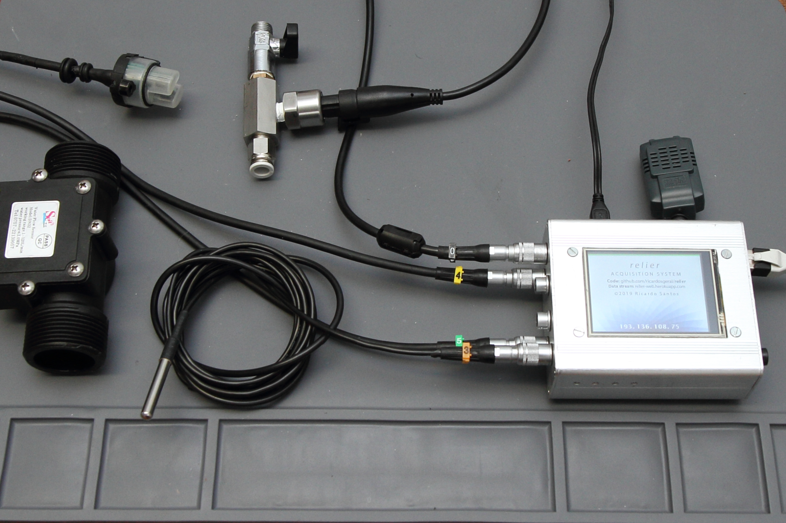

### Some project videos

| Sensors overview and GUI |  Assembly of acquisition system|
|--------------------------|--------------|
| [](https://youtu.be/-2fSeosClVY)|  [](https://youtu.be/6blSNBFLsIU)                              |


[](https://www.youtube.com/watch?v=ju51FE9KWwY)

### Is this for me?
If you need to do a similar project, you just need to have some DIY skills, for scrapping some materials, figuring out 
how to assemble some things together, and investigate how some components work.
The instructions given here should also be taken more like guidelines based on "what I can do with the materials I have". If 
you do not have the exact same hardware components 
(sensors, ADC, level shifter, touchscreen...), yours will surely work a little different, but as they should do the same 
things, there will be similarities too. You may have to adjust the code and/or the connections to meet your needs.

Feel free to contact me if you manage to get it working with different components, so these instructions can be improved 
and be more helpful. 


## 1. Hardware

The hardware components required to make the ***relier*** *acquisition system* are indicated in this chapter. 
Instructions about the way those components are connected are presented.
For reference, some links and prices of each component are indicated.

The *Hardware* is composed by the: 

+ ***Aquisition box*** (*server*, *touchscreen*, *custom PCB HAT* and *connection plugs*);
+ ***Sensors*** (4 with analog outputs and 3 with digital outputs).

### 1.1. Aquisition Box

The main items of the *acquisition box* are the following:
 
 + ***Server***: *Raspberry Pi 3 model B*;
 + ***2.8" Touchscreen***: *Nextion HMI display*;
 + ***Custom PCB HAT***: made specifically for this project ([details about the PCB design](https://github.com/Ricardosgeral/relier/blob/master/README.md#14-custom-pcb-raspberry-pi-hat)).
 
All these main components are placed inside an aluminum enclosure box, in which openings were made, for the power supply, display, and connections. 
Peripheral inputs to collect sensors data, and peripheral outputs (USB ports) to storage sensors data, are also available. 
The acquisition box is powered solely through the power supply connected to the Raspberry Pi (output: DC5V, 2A). 

| 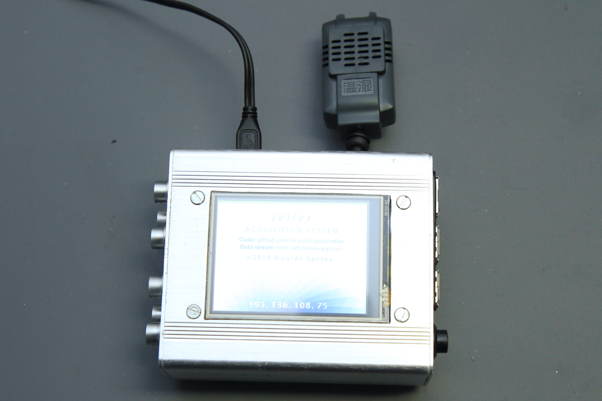  | 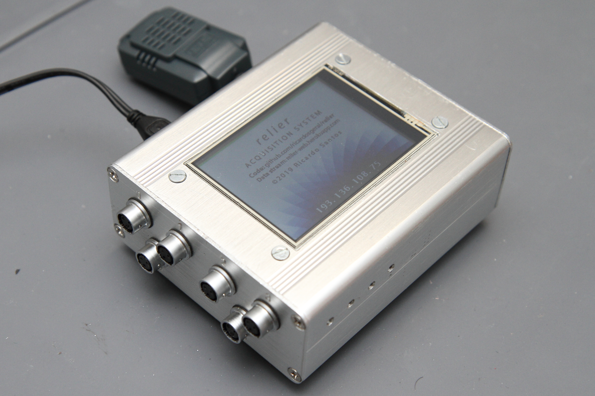  |
|----------------------------------------|----------------------------------------|
|   | 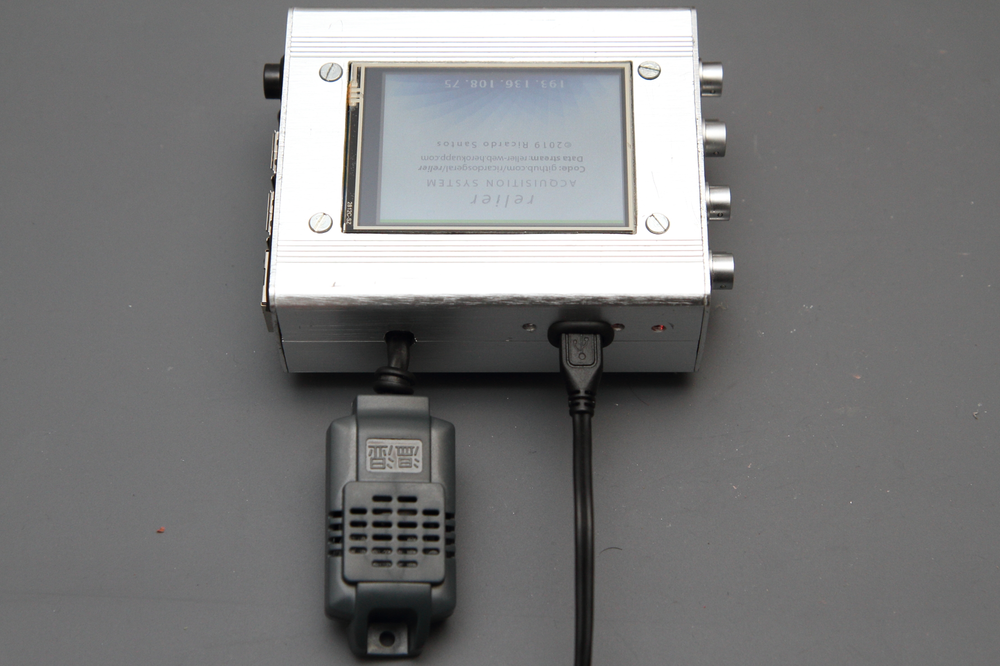  |
| 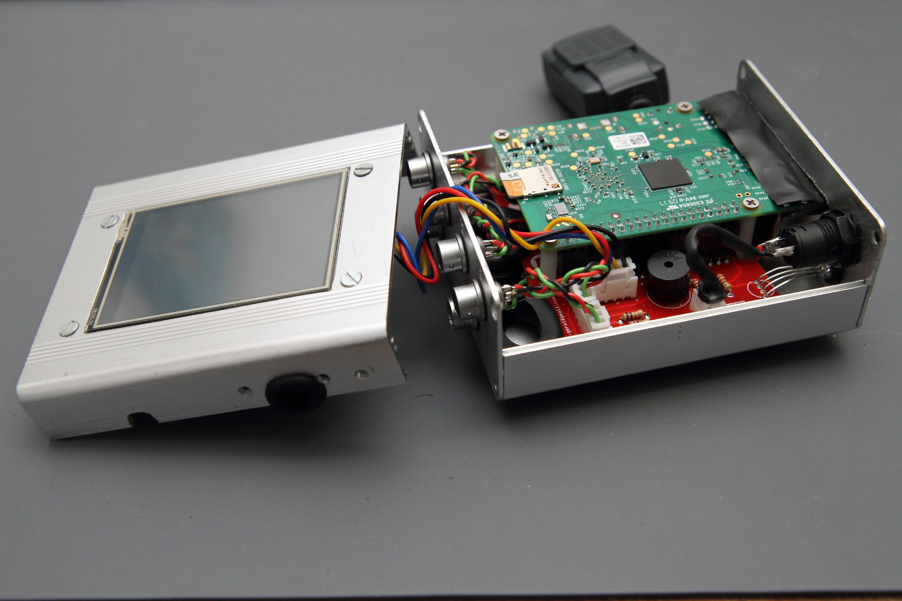  | 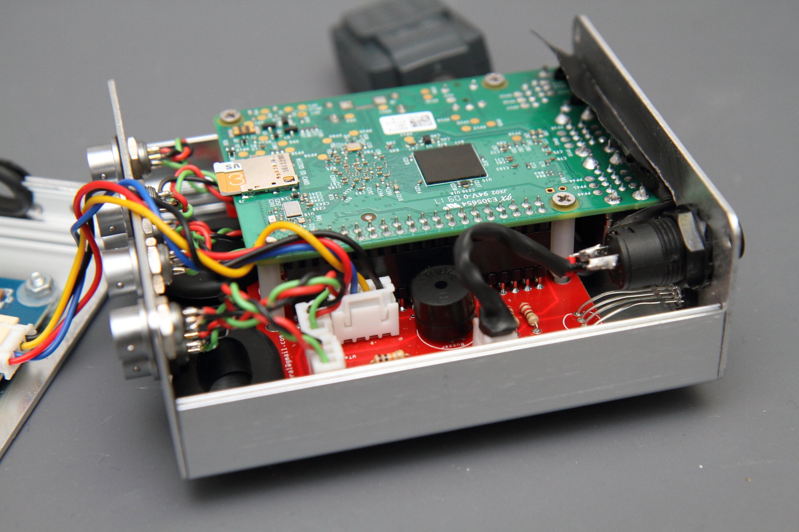  |


https://i.imgur.com/RYcSZy1.jpg


You can find more pictures and an overview video in the [Media folder](https://github.com/Ricardosgeral/relier/tree/master/Media) of this GitHub repository.


### 1.2. Sensors

The ***relier*** *acquisition system* is prepared to simultaneously collect data from the following ***'low cost' sensors***:

+ **Channels 0-2**    : Analog pressure transducer sensor (Piezometric water pressure);
+ **Channel 3**       : Waterproof DS18B20 Sensor (Water temperature);
+ **Channel 4**       : Analog turbidity sensor (Water turbidity);
+ **Channel 5**       : Turbine flow Sensor (Water flow); and
+ BME280 sensor (Air temperature, humidity and pressure).

Most of the sensors are connected using the 6 mini aviator (circular) plugs that are linked to the custom PCB HAT. 
An exception is the *BME280* chip, which can be soldered directly to the custom PCB or using a short 4 wires cable. 
This last option is preferable, because, ideally, to monitor the ambient air temperature/humidity/pressure, 
the *BME280* should be placed outside the AS box (or at least, inside the box, but near large openings), 
to avoid the heat generated by the touchscreen and by Raspberry Pi!

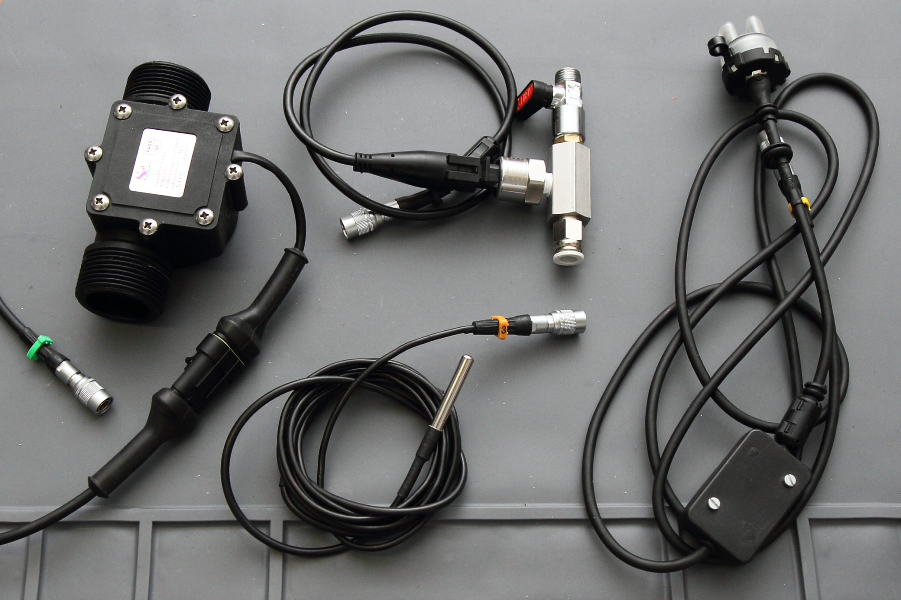


**Note**:
***relier*** was designed to use low budget sensors. Thus, initially, only allowed the use of a turbine type flowmeter. 
However, since LNEC laboratory owns an Eletromagnetic type flowmeter ([Danfoss MAGFLO 5000](http://apps.watersurplus.com/techlib/Fluidyne/Fluidyne_Flowmeter_Mag1100_Mag3100_spec_D499.pdf)),
the software was adapted to also allow its use (communication via USB serial port of the Raspberry Pi).
Please beware that such devices are much expensive (1500-2000 €) than turbine flowmeters (< 20 €). 
The user should choose, in each test, one of these types of flowmeter.

The following table indicates the advantages and drawbacks of each type of flowmeter allowed. 

**Flowmeter type** |                                        |**Advantages**                                   | **Drawbacks**                                                              |
-------------------|----------------------------------------|-------------------------------------------------|----------------------------------------------------------------------------|
Turbine            |   |Cheap; Fast response to sudden drop/rise of flow | Low accuracy for low flow rates (may be even unable to detect low flow)    | 
Eletromagnetic     |   |Better accuracy, even for low flow rates         | Expensive; Somewhat smother variation of flow, for sudden drop/rise of flow|

### 1.3. Bill of materials (BOM)

The following tables show the bill of materials (BOM) of the items used in ***relier*** **AS**, as well as their main specs and indicative prices (in January 2019).

#### Acquisition Box

| **Qt**  | **€/un*** | **Ʃ €** | **Photo**                                   | **Description**                                                                                                                                                                                                        | Notes                                                                               |
|---------|----------|----------|---------------------------------------------|------------------------------------------------------------------------------------------------------------------------------------------------------------------------------------------------------------------------|-------------------------------------------------------------------------------------|
| 1       | 35       | 35       |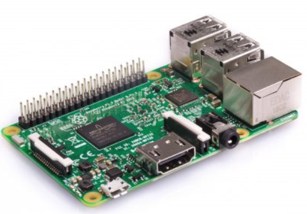            |[Raspberry pi 3B](https://www.raspberrypi.org/products/#buy-now-modal)                                                                                                                                                  | Server                                                                              |
| 1       | 16.2     | 16.2     |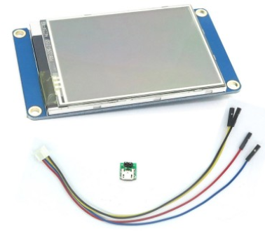        |[Nextion HMI touch display 2.8"](https://www.itead.cc/nextion-nx3224t028-1933.html)                                                                                                                                     | Graphical User Interface (GUI)                                                      |
| 1       | 6.2      | 6.2      |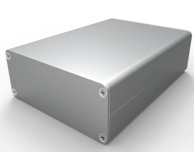      |[Aluminium enclosure box (88x38x100mm)](https://www.aliexpress.com/item/Free-shipping88-38-100mm-width-x-high-x-length-aluminum-extrusion-box-profile-enclosure-for-PCB/32800855972.html?spm=a2g0s.9042311.0.0.Wvmz38)  | Aluminium enclosure box                                                             |
| 2       | 10       | 20       |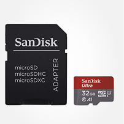        |Micro SD card (>16GB)                                                                                                                                                                                                   | One for the raspberry pi and another for the Nextion display (during installation)  |
| 1       | 8        | 8        |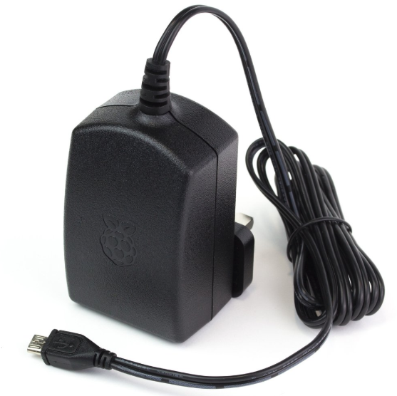   |[Raspberry Pi Power Supply](https://www.raspberrypi.org/products/raspberry-pi-universal-power-supply)                                                                                                                   | Power up the raspberry pi and the sensors                                           |
| 1       | 1        | 1        |      |[**Raspberry pi Hat - Custom PBC**](https://www.pcbway.com/project/shareproject/Relier_Acquisition_system___for_Rasoberry_pi3_b_.html)**:**                                                                             | Interlinks server, touchscreen and the sensors                                      |
| 1       | 1.4      | 1.4      |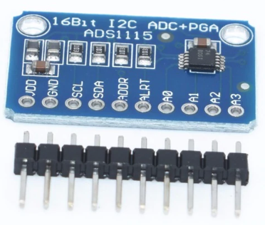            |► [16 Bit I2C ADS1115 Module ADC 4 channel with Pro Gain Amplifier](https://www.aliexpress.com/item/16-Bit-I2C-ADS1115-Module-ADC-4-channel-with-Pro-Gain-Amplifier-RPi-1PCS/32817162654.html)                         | Analog to Digital conversion for analog sensors                                      |
| 1       | 0.3      | 0.3      |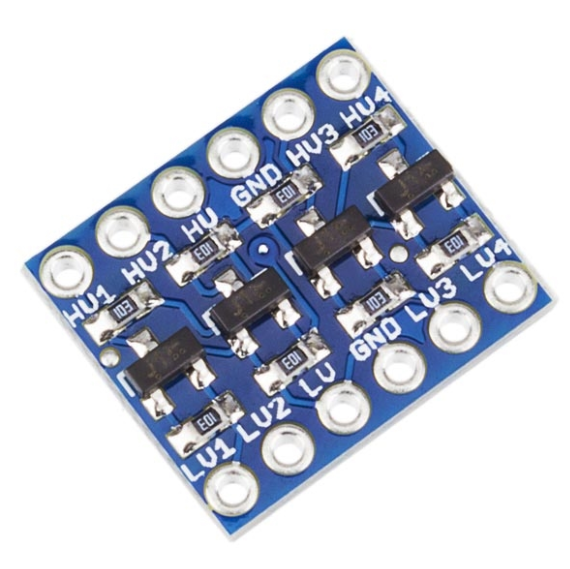        |► [Logic Level Shifter Bi-Directional 5V to 3.3V](https://www.aliexpress.com/item/5PCS-Logic-Level-Shifter-Bi-Directional-For-Arduino-5V-to-3-3V-Four-Way-Two-Way/32827270848.html)                                    | Required for stability, since ADS1115 requires 5V and Raspberry I2C pins use 3.3V    |
| 6       | 3.8      | 22.8     |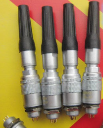 |► [8mm Male & Female Connector miniature Aviation Plug M8 Circular Socket+Plug](https://www.aliexpress.com/item/1PCS-AP049-YC8-2-3-4-5-6-7Pin-8mm-Male-Female-Connector-miniature-Aviation-Plug/32845374887.html)      | Connection of the sensors to the acquisition box                                     |
| 6       | 0.2      | 1.2      |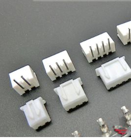          |► [XH2.54 3-Pins connectors Male for PCB - Header+Housing+Terminal](https://www.aliexpress.com/item/XH2-54-2P-3P-4P-5P-6P-7P-8P-9P-10P-11P-12P-13P-14P-15P/32793262315.html)                                           | Connection to the custom PCB                                                         |
| 2       | 0.2      | 0.4      |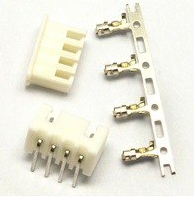        |► [XH2.54 4-Pins connectors Male for PCB - Header+Housing+Terminal](https://www.aliexpress.com/item/XH2-54-2P-3P-4P-5P-6P-7P-8P-9P-10P-11P-12P-13P-14P-15P/32793262315.html)                                           | Connection to the custom PCB                                                         |
| 1       | 0.9      | 0.9      |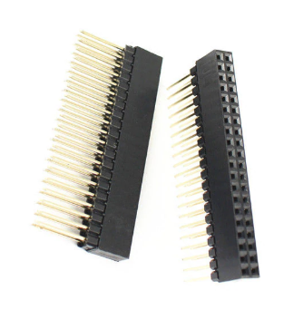           |► [PC104 2.54mm Pitch 2x20 Pin 40 Pin Female Double Row Long Pin Header Strip](https://www.aliexpress.com/item/2-Pcs-PC104-2-54mm-Pitch-2x20-Pin-40-Pin-Female-Double-Row-Long-Pin-Header/32805691836.html)            | Connection between Raspberry GPIO pins and the custom PCB                            |
| 1       | 0.2      | 0.2      |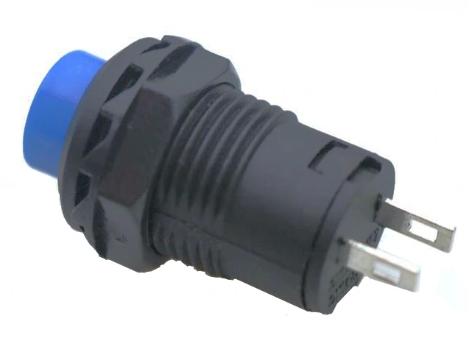         |► [Momentary pushbutton switch 3A Reset Button](https://www.aliexpress.com/item/10pcs-Momentary-Push-Button-Switch-12mm-Momentary-pushbutton-switches-3A-125VAC-1-5A-250VAC-Reset-Button/32802331189.html)             | Safe restart/shutdown button of the Raspberry Pi                                     |
| 1       | 0.1      | 0.1      |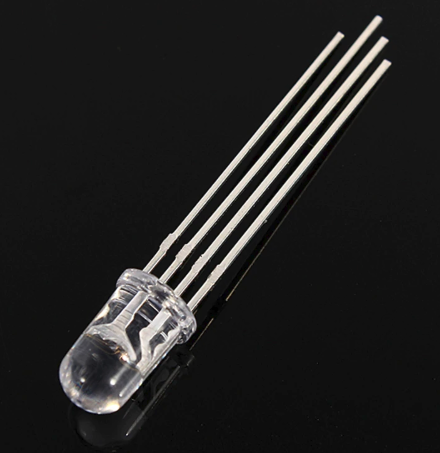        |► [5mm Through-Hole RGB LED](https://www.aliexpress.com/item/100pcs-lot-Transparent-Round-5mm-RGB-LED-Common-Anode-LED-Light-Emitting-Diode-Lamp/32278301731.html)                                                     | Indicative multicolor LED                                                            |
| 1       | 0.1      | 0.1      |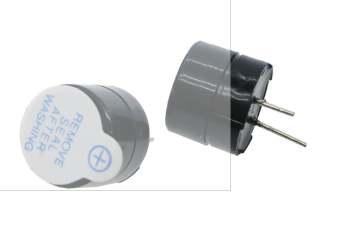         |► [Active Buzzer Alarm 5 V](https://www.aliexpress.com/item/10pcs-5v-Active-Buzzer-Magnetic-Long-Continous-Beep-Tone-Alarm-Ringer-12mm-MINI-Active-Piezo-Buzzers/32914327679.html)                                     | Audible sound to alert for the end of a test                                         |
| 3       | 0.02     | 0.06     |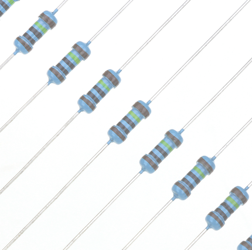    |► [220 Ω carbon film resistor](https://www.aliexpress.com/item/100pcs-1-4W-Metal-film-resistor-1R-1M-100R-220R-330R-1K-1-5K-2-2K/32847011772.html)                                                                     | Protection of the RGB LED                                                            |
| 2       | 0.02     | 0.04     |    |► [10 kΩ carbon film resistor](https://www.aliexpress.com/item/100pcs-1-4W-Metal-film-resistor-1R-1M-100R-220R-330R-1K-1-5K-2-2K/32847011772.html)                                                                     | 1 used as voltage divider (turbine flowmeter) and other for water temperature sensor |
| 1       | 0.02     | 0.02     |    |► [20 kΩ carbon film resistor](https://www.aliexpress.com/item/100pcs-1-4W-Metal-film-resistor-1R-1M-100R-220R-330R-1K-1-5K-2-2K/32847011772.html)                                                                     | Voltage divider (turbine flowmeter)                                                  |
| 3       | 0.01     | 0.03     |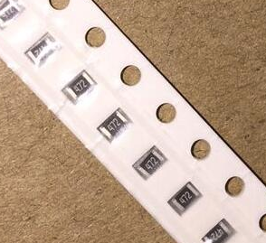   |► [0805 SMD 1/4W resistor 1MΩ](https://www.aliexpress.com/item/100Pcs-0805-SMD-1-4W-chip-resistor-0R-10M-0-10R-100R-220R-330R-470R-1K/32933956924.html)                                                                | Pull up resistors (to know when analog sensors are disconnected)                     |
| 6       | 0.1      | 0.6      |                                             |► 5 cm cable with 3 wires                                                                                                                                                                                              | Connection between mini aviator plugs and XH2.54 3 pin connectors                    |
| 1       | 0.1      | 0.1      |                                             |► 8 cm cable with 4 wires                                                                                                                                                                                              | Connection between BME280 and the custom PCB                                         |
|         |          | **115€** |                                             |                                                                                                                                                                                                                       |                                                                                     |

*The unitary prices don't include eventual shipping costs. 
For some items, it may be difficult to buy individual components and may be necessary to buy them in sets. 
There may exist cheaper alternatives. The prices indicated correspond to the components bought.

#### Low budget sensors

| **Qt**  | **€/un***| **Ʃ €** | **Photo**                                    |**Description**                                                                                                                                                                                                                    | Notes                                                                                          |
|---------|----------|---------|----------------------------------------------|---------------------------------------------------------------------------------------------------------------------------------------------------------------------------------------------------------------------------------- |------------------------------------------------------------------------------------------------|
| 3       | 13       | 39      |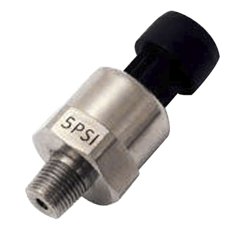  |[Analog Pressure Transducer Transmitter Sensor, 0-5psi 0.5-5V](https://www.aliexpress.com/item/1Pc-Pressure-Transducer-Sender-Stainless-Steel-for-Oil-Fuel-Air-Water-5psi-CSL2017/32814346612.html)                                | Measurement of water pressure at different levels (piezometers)                                |
| 1       | 9        | 9       |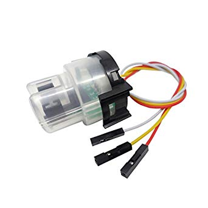            |[Analog Turbidity Sensor, 5V 40mA](https://www.aliexpress.com/item/DFRobot-Gravity-Analog-Digital-Turbidity-Sensor-5V-40mA-DC-support-both-signal-output-compatible-with-arduino/32595773560.html)                                 | Measurement of the turbidity of effluent water                                                 |
| 1       | 13       | 13      |         |[Digital Turbine Flow Sensor, G5/4, 1.25", DN32, 1~120L/min](https://www.aliexpress.com/item/DN32-Water-Flow-Meter-Sensor-Switch-G5-4-Thread-Port-Industrial-Flowmeter/32567971320.html)                                           | Measurement of the water flow (the system also allows the use a electromagnetic type flowmeter)|
| 1       | 1        | 1       |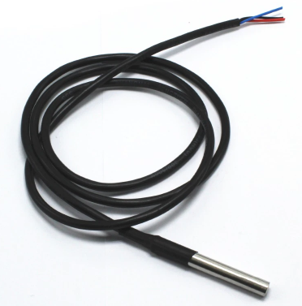      |[Waterproof DS18B20 digital Temperature Sensor](https://www.aliexpress.com/item/1pcs-New-Digital-Temperature-Temp-Sensor-Probe-DS18B20-For-Thermometer-1m-Waterproof/1297739612.html)                                              | Measurement of the water temperature                                                           |
| 1       | 3        | 3       |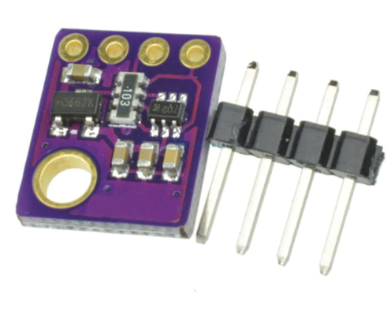          |[BME280 Digital Sensor, Humidity, Temp. and Barometric Pressure Sensor](https://www.aliexpress.com/item/3In1-BME280-GY-BME280-Digital-Sensor-SPI-I2C-Humidity-Temperature-and-Barometric-Pressure-Sensor-Module-1/32659765502.html)| Measurement of the atmospheric temperature, humidity and pressure                              |
|         |          | **65€** |                                              |                                                                                                                                                                                                                                   |                                                                                                |                                                                                      |


#### Total cost

The total estimated cost of the ***relier*** **AS** is about **180 €**, considering the use of low budget sensors. 
This value excludes costs related to other supplementary materials required for the assembly of the custom PCB (e.g. solder wire or DIY tools).


### 1.4. Custom *PCB* (Raspberry Pi HAT)
The design of the 2 layer's *PCB* was developed using the open-source software [Fritzing](http://www.fritzing.org/). 
The production files and the *.fzz* file are [here](https://github.com/Ricardosgeral/relier/tree/master/Fritzing). 
Latest version of *PCB* is v3.2 (November 2018). 
The *PCB* was produced/printed by [PCBWay company](https://www.pcbway.com/). 
You can order them a copy [here](https://www.pcbway.com/project/shareproject/Relier_Acquisition_system___for_Rasoberry_pi3_b_.html)).

Below, you can see images showing the circuits hooked in the breadboard and in the PCB, as well as the final 
aspect of each *PCB* layer individually. 
[Here](https://www.raspberrypi-spy.co.uk/2012/06/simple-guide-to-the-rpi-gpio-header-and-pins/#prettyPhoto/1/)
you can see the numbering of the 40 GPIO pins of the Raspberry Pi used.


**PCB: breadboard view**
_bb.png)


| **PCB: bottom Layer**                                           | **PCB: top layer**                                       |
|-----------------------------------------------------------------|----------------------------------------------------------| 
| 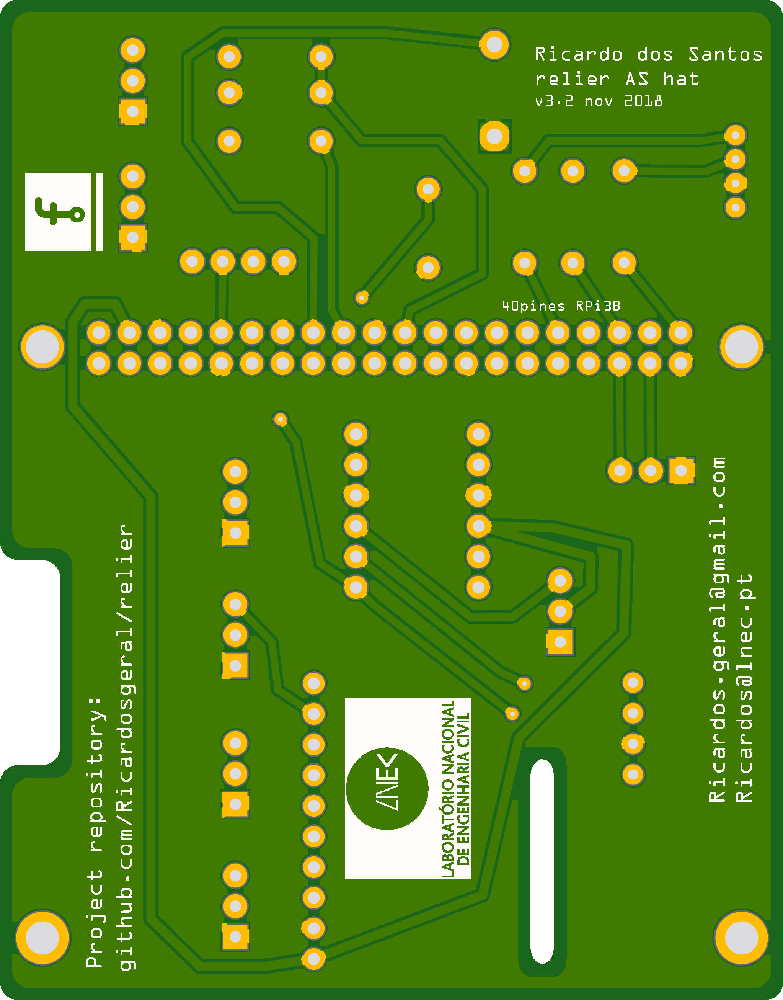  | 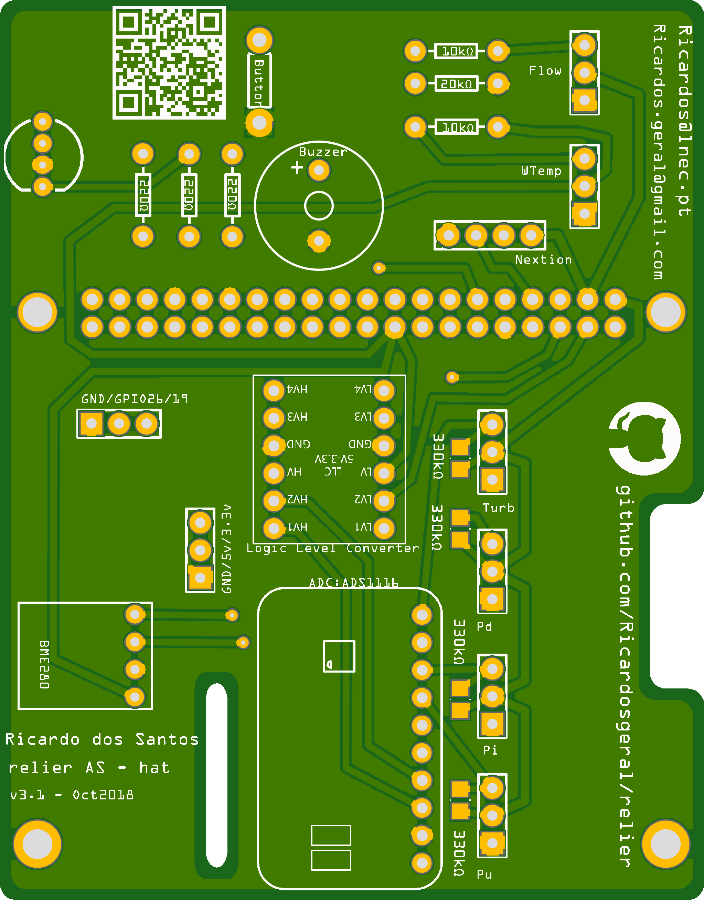 |
| _below_pcb.png)  | _top_pcb.png)|
| 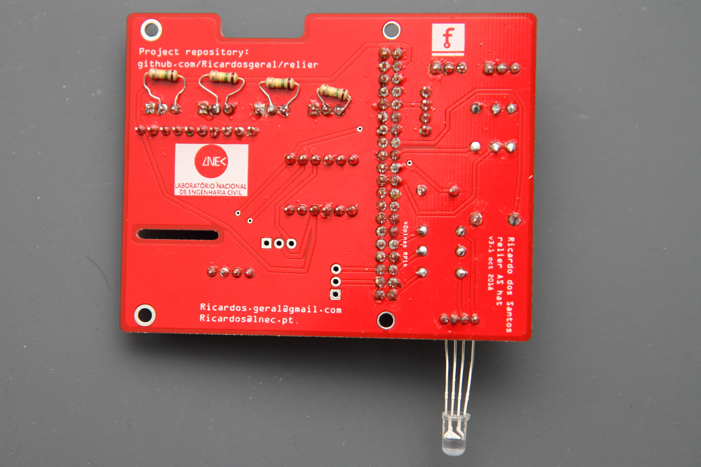  | 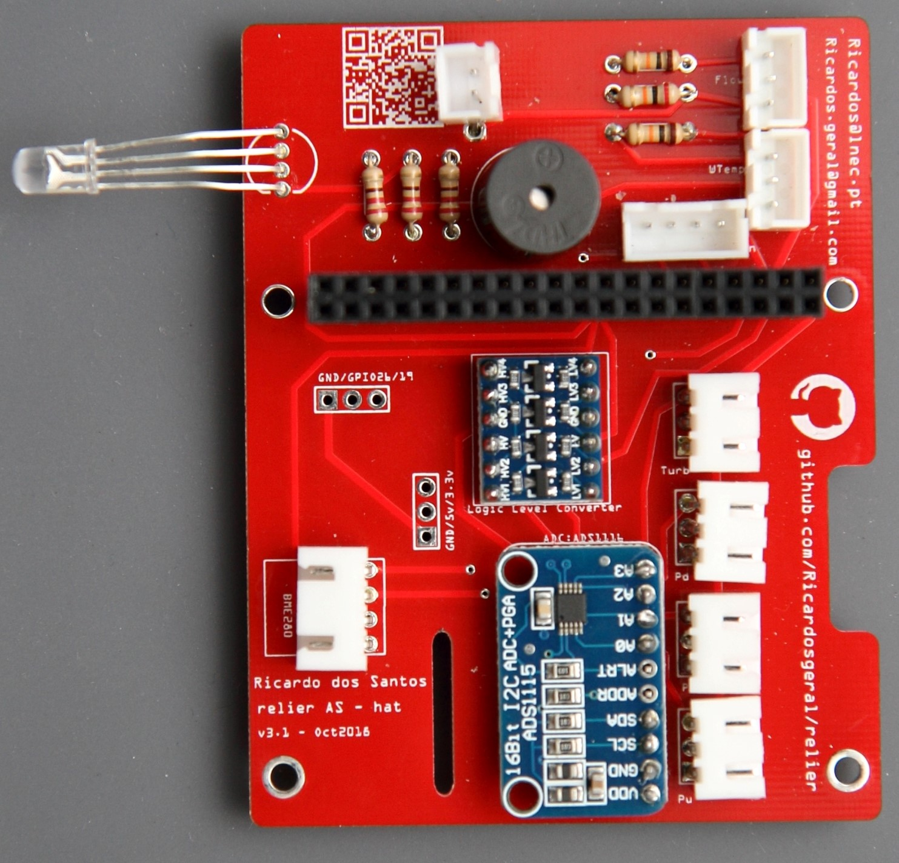|

**PCB: scheme**
_schem.png)


### 1.5. Other components that may be useful for debugging
+ Breadboard(s)
+ [T-cobbler for raspberry pi](https://www.aliexpress.com/item/830-tie-points-MB102-breadboard-40Pin-Rainbow-Cable-GPIO-T-Cobbler-Plus-Breakout-Board-Kit-for/32673580640.html?spm=2114.search0104.3.9.6581309ai8NJdY&ws_ab_test=searchweb0_0,searchweb201602_1_10152_10151_10065_10344_10068_10342_10343_5722611_10340_10341_10698_10696_5722911_5722811_10084_5722711_10083_10618_10304_10307_10301_5711211_10059_308_100031_10103_10624_10623_10622_10621_10620_5711311_5722511,searchweb201603_32,ppcSwitch_5&algo_expid=3ed88c37-67f1-4fe2-a688-b3983db90ff7-1&algo_pvid=3ed88c37-67f1-4fe2-a688-b3983db90ff7&transAbTest=ae803_2&priceBeautifyAB=0)
+ DuPont jumper wires
+ Micro SD adapter
 
### 1.6. Additional tools required in the assembly of the Raspberry Hat and of the enclosure
+ Wire Stripper/Crimping tools
+ Soldering iron + solder wire
+ Tools to make the openings in the aluminum box (*eg* a mini Drill DIY set) 
+ Precision screwdriver set

## 2. Software

The  ***relier*** *acquisition system* is composed by two distinct but interconnected programs, particularly the:

+ **Server software**: *runs in the Raspberry Pi*, and performs the computation tasks, and
+ **Touchscreen software**: *runs in the Nextion device*, and is responsible by the interactivity between the end user and the server.


### 2.1. Server software: installation
The server is a Raspberry Pi 3 model B (it was also tested successfully with a RPi 3 B+).
 These instructions should be carried out after a fresh installation of *Raspbian* image in a Micro SD card 
(see [instructions](https://www.raspberrypi.org/documentation/installation/installing-images/README.md)). 
The server has been tested with [2018-11-15-raspian-stretch](http://downloads.raspberrypi.org/raspbian/images/raspbian-2018-11-15/). 
Most of the code is written in *Python v3.5.3*, and a few scripts are written in *Bash v4.4.12(1)*.

**Note:** If no monitor is available (*Raspberry Pi* headless setup), the following 4 simple steps are required to 
enable *SSH* on first boot. So, right after installing the Raspbian image in the  Micro SD card:
1. Create an empty file (in Windows use notepad, in a Linux terminal use command *touch*, in Mac use TextEdit).
2. Save the file with name: ***ssh*** (preferentially with no extension, but *ssh.txt* should also work).
3. Copy or move that file into the ***root*** of the Micro SD card, where Raspbian image is installed.
4. Insert the Micro SD card into the *Raspberry Pi*, and power it on.

Access the *Raspberry Pi* directly (if you have a monitor), or via *SSH* (for example, using [*Putty*](https://www.putty.org/)). 
In this last option, you will require an internet connection, and need to know the local IP attributed to the *Raspberry Pi* ! 
The default login parameters should be:

   username: `pi`   
   password: `raspberry`

It is recommended to change the password after first boot, since *SSH* is enabled! For that write down in the terminal

    $ passwd 
    
and choose your new password.

Now, if you haven't done it yet, you need to connect the *Raspberry Pi* to the internet (via Ethernet cable or [WiFi](https://www.raspberrypi.org/documentation/configuration/wireless/wireless-cli.md)).  
Then, in the terminal, run the following sequential commands:
    
    $ cd /tmp && wget https://raw.githubusercontent.com/Ricardosgeral/relier/master/bash/raspbian-post-install.sh
    $ sudo chmod +x raspbian-post-install.sh && sed -i 's/\r//' raspbian-post-install.sh
    $ sudo ./raspbian-post-install.sh

Prepare a big cup of hot tea, since this can take some minutes! The raspberry should reboot automatically!

**Note:** During installation of the server, [VNC](https://www.realvnc.com/en/raspberrypi/) is also enabled, 
case you want to use it. 


#### Google Credentials

***relier AS*** has the ability to send the main test results to google sheets, but, for that, it requires some configurations.
If you don't need this feature you can skip it.

After reboot of the RPi, you need to get your *json* file with your Google Signed credentials.
First, you need to create a project in the developer console and enable some APIs (follow steps 1 to 4 from these [instructions](https://pygsheets.readthedocs.io/en/latest/authorizing.html#)), 
then, get the *Signed credentials* (follow steps 5 and 6 from these [instructions](https://pygsheets.readthedocs.io/en/latest/authorizing.html#signed-credentials)). 
*Copy* your Signed credentials, then, do:

    $ sudo nano /home/pi/relier/service_creds.json
    
and *Past* the Signed credentials. `Ctrl+X`, then `y` and finally `Enter` to save file.

    $ sudo reboot


And that's it, after reboot, the *Raspberry Pi* is set properly. 
However, you still need to install the **Touchscreen software**!

### 2.2. *Touchscreen* software: installation

The graphical user interface (GUI) runs on a [*Nextion*](https://nextion.itead.cc/) smart touchscreen, 
also referred as an *HMI - Human Machine Interface*. 
Note that, this device does not work like typical TFT or HDMI monitors. 
A code needs to be developed and uploaded to the device using a Micro SD card. 
The connection between *Nextion device* and the *Raspberry Pi* is made via 
[*Serial UART*](https://www.allaboutcircuits.com/technical-articles/back-to-basics-the-universal-asynchronous-receiver-transmitter-uart/), 
that is, via serial communication in pins GPIO14 (TXD) and GPIO15 (RXD) (in all Raspberry models).

The GUI needs to be developed in the [Nextion Editor](https://nextion.itead.cc/resources/download/nextion-editor/) (free software - only for windows!).
Follow the [Nextion Editor Guide](https://nextion.itead.cc/editor_guide/) to learn how to work with it. 
I've provide the file [*relier.HMI*](https://github.com/Ricardosgeral/relier/blob/master/Nextion/HMI/relier.HMI) 
developed for this project. The next picture shows the Nextion Editor with the project file.

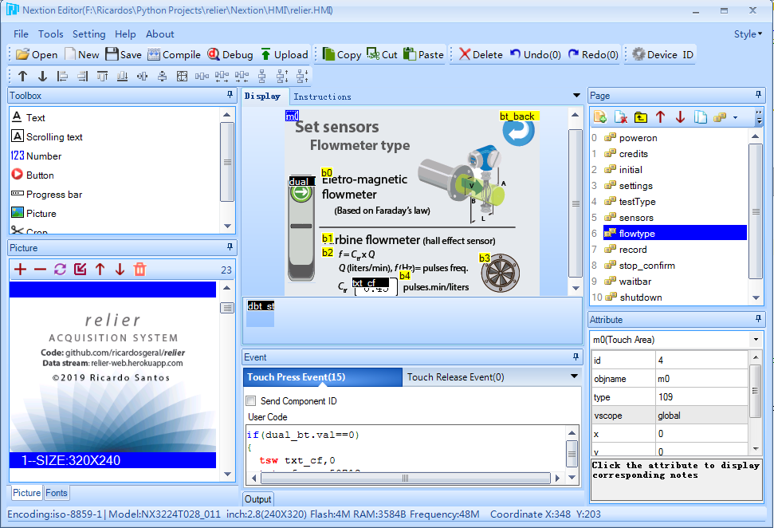

To upload the code into *Nextion device touchscreen* follow these steps:

1. Open the [*relier.HMI*](https://github.com/Ricardosgeral/relier/blob/master/Nextion/HMI/relier.HMI) file
with the Nextion Editor.
2. Press the *Compile* icon in the first top bar, and check that there are no errors.
3. Go to *File > Open build folder* and copy the *relier.tft* file produced by the editor (that has the code). 
4. Past the file into a formatted micro SD card. I recommend using the windows format tool, 
to ensure the card is empty. Don't forget to safe eject the sd card.
5. Disconnect the power supply to *Nextion*.
6. Insert the micro SD card in the slot on the back of the device.
7. Reconnect the power supply to *Nextion*. You should see the *SD card update* status. 
When you see `Check data.. 100%`, the code was uploaded successfully.  
8. Disconnect again the power supply to the screen, and remove the micro SD card (it will not be necessary anymore).
9. In next start up, the software with the code, developed in the Nextion Editor, is running 
and the GUI is set on the touchscreen.

**Note:** Be very careful when buying the *Nextion* device. Confirm that you are not getting a *TJC* (for the Chinese market), 
which looks identical. 
*TJC* screens only work with the Chinese version of the Nextion Editor! You will need to learn Chinese to use it !!!!
 

## 3. Graphical User Interface (GUI): How to use
 
The *GUI* pages displayed in the touchscreen (*Nextion device*), and their usage, are shown next.
 
### *Connecting* page
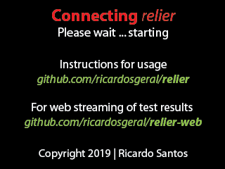

Right after a start up or reboot of the *Raspberry Pi*, you should see this **Connecting** black page. 
Waiting a while (tipically 20 seconds, but can vary from 15 to 60 seconds, depending on the pending OS services) 
you should see the **Credits** page. 
In that process you should see fast blink of the led (with purple color) placed in the AS box.


### *Credits* page

First, you will see a *red* flag on the top of the screen. Wait (less than 5 seconds).
After some server checks, the flag should then stay *green*, meaning that the server and touchscreen are working Ok. 
You can also see the local *IP address* of the server, 
which is useful in case you want to make a remote connection. 

| *not ready*: red flag                                    |  *ready*: green flag                                      |
|----------------------------------------------------------|-----------------------------------------------------------|
|  | |

If the server is not connected to the internet, then the following message is displayed: `No internet connection`.

To update the IP status case the internet connection has been changed (e.g., insertion of an Ethernet cable, connection to WiFi, ...), 
wait a couple of seconds, then touch on the IP message (bottom of the screen). 
Touch anywhere else on the screen to go the **Main menu** page.
 
### *Main menu* page

 
You have three options:
 1. ***Settings***: set the *test inputs* >> Redirects to **General settings** page.
 2. ***Sensors***: set the *calibration inputs* of water pressure sensors and choose flowmeter type >> Redirects to **Set sensors** page.
 3. ***Start***: initiate the test right away >> Redirects to **Sensors data record** page.
 
You can skip options 1 and/or 2, case you use the files
[*inputs.ini* ](https://github.com/Ricardosgeral/relier#5-inputs-file-inputsini), 
[*calibturb.txt*](https://github.com/Ricardosgeral/relier#calibturbtxt-file)
and you are confident that the calibration
parameters of the pressure sensors, specified in that file, are accurate enough. 
 
### *General settings* page
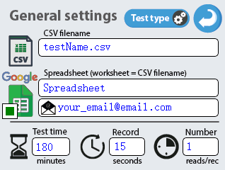

Here, you can edit interactively the test inputs:
- *CSV filename* textbox - name of the CSV file were test data is saved.
- *Google Sheets* checkbox - select it, to send test data to Google Sheets during the test. Disable it if you haven't configured the google credentials.
- *Spreadsheet* textbox - name of the Google spreadsheet (worksheet name = *CSV filename*). Not used if *google sheets* checkbox is disabled.
- *email* textbox - email to where a link, to access the Google spreadsheet, will be sent. Not used if *google sheets* checkbox is disabled.
- *Test time* textbox - duration of the test, in minutes ( if 0 is selected → records data 'forever' or until user stops it).
- *Record* textbox - interval between records, in seconds.
- *Number* textbox - number of readings in each record interval (for analog outputs only).

Pressing the blue button on top-right corner goes back to **Main menu** page. 
There is also a blue button that allows the user to select the **Test type**.


### *Test type* page
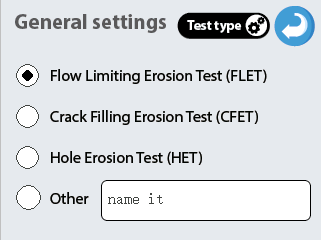

This page allows the selection of the type of test you want to perform.
Note that, selecting the option <Hole Erosion Test (HET)>,
***no*** data of the interface (middle) pressure sensor will be acquired, 
since HET only uses two pressure sensors (upstream and downstream).
If you select <**Other**>, a textbox is enabled for the user to give a name to the test type. 
In this case, test data from all sensors is recorded.

To go back to the **General settings** page, click the blue return button. 

### *Set sensors* page
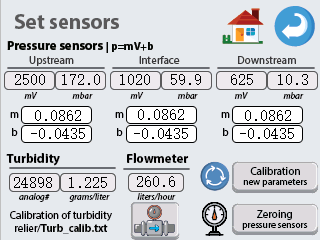

This page allows to see the sensor data (piezometric pressure, flow and turbidiy), which should be displayed every second.

It can also be used to set the calibration parameters of the analog pressure sensors and of the turbidity sensor. 

For the pressure sensors a linear relation, between the analog readings and the effective measurements, is assumed. 
***m*** and ***b*** are the calibration parameters.

The calibration of turbidity is made *exclusively* using the file *turbcalib.txt*. 
First line of this file is ignored and values should be separated by tab or spaces. 
Decimal separator should be a point (.), **not** a comma (,).

To edit the file, open a terminal and type:

    $ sudo nano /home/pi/relier/turbcalib.txt 

The following table indicates the units that should be considered for the calibration parameters.

| Sensors             | ***x*** (analog from ADC)    | ***y*** (measurements) | Relation y = f(x)      |
|:--------------------|:-----------------------------|:-----------------------|------------------------|
| Pressure transducer | voltage,V (*Volt*)           | pressure, p (*bar*)    | ***p = m V + b***      |
| Turbidity           | 0 to 32767 (15 bits >> 2^15) | turbidity (gr/liter)   | ***turbcalib.txt***    |


This page also includes:

a) ***Calibration* button**: to update readings after setting new input parameters.

If you modify  the *m* and *b* parameters of any of the sensors, you need to push the *Calibration* button, 
in order to see the influence on the pressure and/or turbidity values. 

b) ***Zeroing* button**: to make current sensor pressures equal to zero.

This functionality can be used to take into account the normal variations of the atmospheric conditions and the normal sensors drift over time.
To use it properly, it is necessary, first, to ensure that *no pressure* is applied to the sensors (besides the ambient pressure).

In such conditions, ideally, the readings from the pressure sensors should indicate null *mbar*. 
However, due to the influence of drift, barometric pressure, ambient temperature, humidity, and others, 
the most likely is that they are not zero. 

If you push the *Zeroing* button at this stage (*ie*, with no external pressure applied), 
you will get a *wait a few seconds* progress bar. After a few seconds, the readings will show up again,
and show the corrected values.
Now the piezometric pressures should be nearly null. The next figure exemplifies the '*zeroing*' procedure, 
which is done in all pressure sensors simultaneously.


***Attention***: the '*zeroing*' process (when desired!) should be done at the beginning of each test, 
 since the history of the zero shift, *z*, is not (intentionally) remembered by the acquisition system after reboot. 

When you consider that the pressure sensors are conveniently calibrated, you can press the *back blue button* (top-right), 
which will send you to the **Main menu** page.

Pushing the *Home* button will send you to the **Credits** page.  
Pushing the *flowmeter icon* button will redirect the user to the ***Flowmeter type*** page 

### *Flowmeter type* page

This page allows to select between a turbine flowmeter and an Eletromagnetic flowmeter.

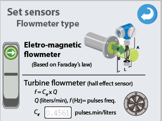

If a turbine flowmeter is selected, the parameter ***Ctf*** should also be indicated (default value is 0.45).  
*f = Ctf x Q*, where *Q* (liters/min) is the flow rate and *f* (Hz) are the pulses frequency. 

Pressing the *back blue button* will bring the user back to ***Set sensors*** page, 
and changes to the flowmeter type are reflected in the flow rate value.


### *Sensors data record* page
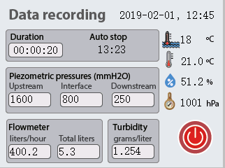

This page appears once the *Start* green button in **Main menu** is released. 
After a couple of seconds, the data being recorded appears in the screen and is updated at a constant rate (*interval* input parameter).

If 'Google Sheets' option has been selected, the first reading can take more than normal (due to the request to access the Google API).

Each time the acquisition system records a set of values, the LED will blink with a green color.

If you want to stop the test, prior to the test duration defined in settings, 
just press the *Red button*, which performs one more reading and then will redirect 
the user to the **Stop recording** confirmation page.

When the predefined test duration is achieved, the server stops acquiring the data. 
The buzz emits some sounds (SOS in morse code! :) ), and the screen is redirected to the *Credits* page.

**Note:** if you want to record data 'forever', set the *Test time duration* input parameter to **0**. 
Actually, it will not record indefinitely. *'Forever'* should be understood as 2 months (86400 minutes!).


### *Stop recording* page
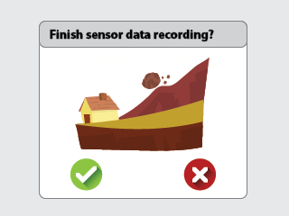

Here you confirm that you pressed the stop button, just in case! Pressing the:

- *Green button* >> stops recording data and directs to **Credits** page. 
- *Red button*   >> go back to **Sensors data record** page, and readings never stopped being registered.
 Buzzer should also alert for the end of the test.

### *Shut down* page

When the physical push button at the lateral side of the acquisition box is hold longer than 3 seconds, the Raspberry Pi shut downs automatically.

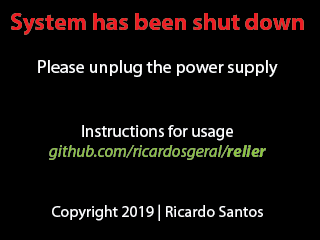 

The user should unplug the power supply, after some seconds (> 10s).


## 4. Web live streaming of data from sensors

In GitHub repository [relier-web](https://github.com/Ricardosgeral/relier-web) 
you can find all the required files to deploy a *Python* application to the internet that allows web streaming of the test data recorded.
In that way you can live view the test results acquired by ***relier*** from any device connected to the internet 
(smartphone, tablet, laptop, ...). 
The acquisition system server should be connected to the internet before the start of the test.  

The picture below shows the the app layout, which is accessed at the site ***https://APP_NAME.herokuapp.com*** (you should choose the <APP_NAME>)
 


## 5. Inputs file: *inputs.ini*

It is possible to set most of the test inputs by editing the file [*inputs.ini*](https://github.com/Ricardosgeral/relier/blob/master/inputs.ini). 
Editing the file avoids setting the inputs interactively in the touchscreen. 
For that, open a terminal and run the command:

    $ sudo nano /home/pi/relier/inputs.ini
     
and change the parameters as intended.

The structure of the *inputs.ini* file comprises 6 sections: [settings], [testtype], [analog], [flowmeter], [ip] and [path]. 
The last two sections are informative only, thus, their edition don't produce any effect!
An example of an *inputs.ini* file, with a description of the meaning of each parameter, is shown below.

#### Example of file *inputs.ini* 
```
[settings]
filename      = soil_X_n01   # <Name of the CSV file> and (if google_sheets = yes) <Worksheet of Google Spreadsheet>
google_sheets = yes          # <yes (y, yep, Yes, YES) or no (n, nop, No, NO)>  
googlesh      = tests_soilX  # <Name of the Google spreadsheet>
share_email   = my@email.com # <email to share access to the Google spreedsheet>
duration      = 180          # <Duration of the test in Minutes> duration = 0 will run 'forever'
interval      = 15           # <Interval between records in seconds>
no_reads      = 5            # <Number of readings per interval (analog sensors only)>: 
                             #  In this example an average between 15/5=3 values is made.

[testtype]
testtype      = 1            # <1 to 4>  1-HET; 2-FLET; 3-CFET; 4-OTHER
othername     = other_name   # < Name of the test type> only relevant when testtype = 4

[analog]                     # Equation of the straight lines for pressure sensors: y = m x + b
mu            = 0.0862       # <Upstream pressure sensor> [ pu(bar) = mu tension_u(Volts) + bu ] 
bu            = -0.0432
mi            = 0.0898       # <Interface pressure sensor> [ pi(bar) = mi tension_i(Volts) + bi ]
bi            = -0.0432
md            = 0.0898       # <Downstream pressure sensor> [ pd(bar) = md tension_d(Volts) + bu ]
bd            = -0.0432

[flowmeter]                  # Parameters about the flowmeter type
flowmeter_type = 1           # < 1 or 2> 1-Eletromagnetic;   2-Turbine  
cf = 0.45                    # Calibration parameter for the turbine flowmeter

[ip]
lastip     = 193.136.108.75  # Parameter is not editable! It's an indication of the server IP in the last test 

[path]
lastpath   = /srv/EROSTESTS/soil_Y_n01.csv  # Location where the results of the previous test were stored.
```

#### Additional notes

+ If the user changes the parameters in the interactive way, [*inputs.ini*](https://github.com/Ricardosgeral/relier/blob/master/inputs.ini) 
will be updated every time the, 
  + server begins to record data (green start button in **Main menu**), or
  + blue back button is released in **Set sensors** page.
+ In such cases, the parameters are kept and are set by default in the next test.
+ Note that the parameters in the *ini* file will not appear always in the same order! 
However, they will always appear in their respective sections. 
That is, for example, the parameter *interval* will always appear in section [settings], 
but may appear at any position inside its section.

## 6. Turbidity calibration: *calibturb.txt* 

The calibration of the turbidity sensor is made mixing successive portions of soil with a know quantity of water. 
The water used in calibration should of the same nature and chemistry of the one that will be used in the soil tests. 
The liquid should be agitated during all the calibration process, to avoid sedimentation of any suspended particles. 
This can be achieved easily using a portable magnetic stirrer. 


Since the turbidity probe is not waterproof, a calibration cup has been designed for safety reasons. 
The design of this calibration cup is available in [Thingiverse](https://www.thingiverse.com/thing:3299997). 
The calibration cup shown in the pictures below was 3D printed in PLA material. Feel free to (re)use the design.

|   |   |
|---|---|
|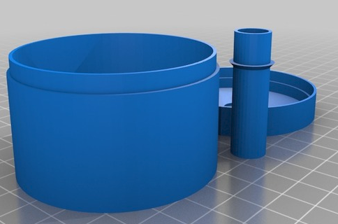 | 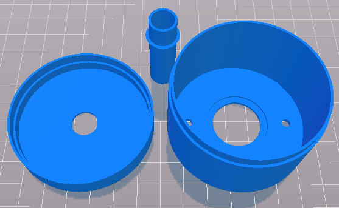|

**Procedure/Steps**

The steps and best practices to achieve a consistent calibration curve for the turbidity sensor are here presented. 
Below are some photos taken during the calibration for the finer fraction of a coarse soil (passing sieve #60, aperture of 6.3 mm)

|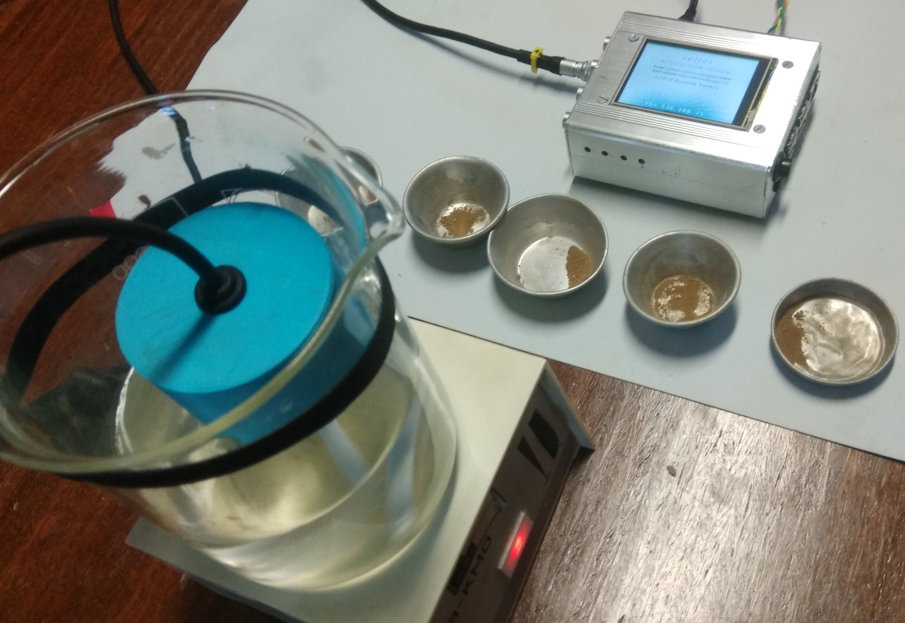 |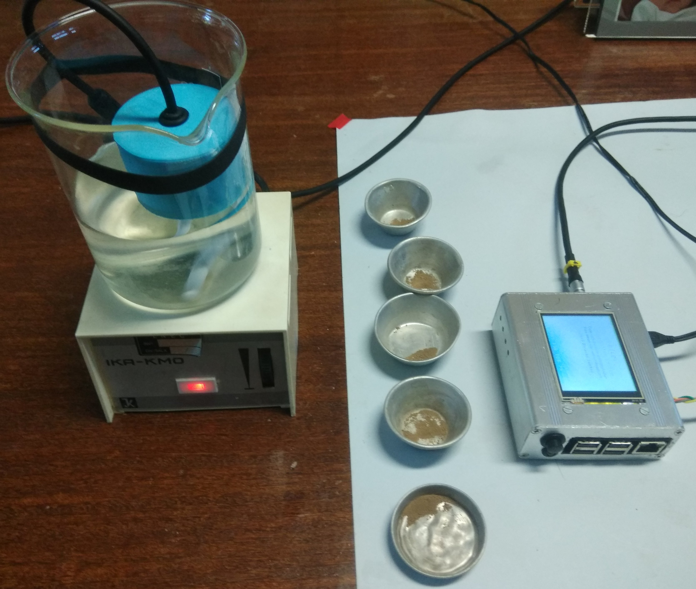 |
|-----|------|
|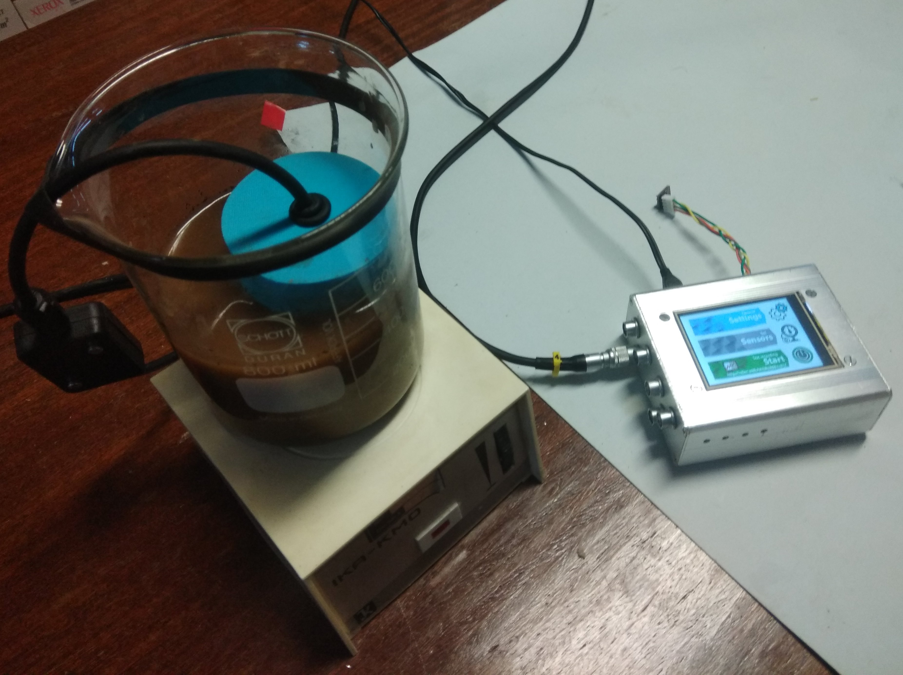 |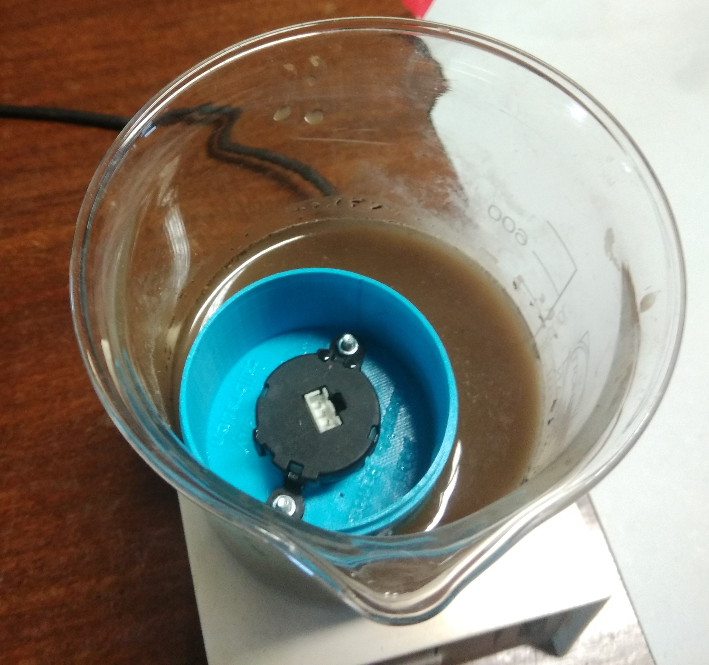|

These are the main steps:
1. Place a know quantity of water (e.g. 500 ml) inside a beaker.
2. Place the beaker over a portable magnetic stirrer. Turn it on, and regulate the spinning in a way that the water is agitated, but without forming a visible vortex.
3. Place the calibration cup (with the sensor) floating in the water.
4. Connect the turbidity sensor to Channel 4 in the acquisition box, and start the system (i.e. connect the RPi to the power supply).
5. Register ***analog#*** of this channel. The register of this values can be done:
    + *Manually* - Navigate to [*Set sensor*](https://github.com/Ricardosgeral/relier/blob/master/README.md#set-sensors-page) page, 
and register the values shown in the turbidity section;
    + *Automatically* - Navigate to [*Sensors data record*](https://github.com/Ricardosgeral/relier/blob/master/README.md#sensors-data-record-page) page, 
and the ***analog#*** values are recorded to the adequate file (see [Data collection](https://github.com/Ricardosgeral/relier/blob/master/README.md#7-data-collection) section).  
6. Add a known mass of the selected soil (e.g. 0.1 grams) to the stirring water. Wait a fee seconds, and then register the new ***analog#*** values,
 which are expected to be smaller than those before adding the amount of soil.
Calculate the turbidity in grams/liter, dividing the cumulative mass of the soil by the total amount of water (e.g. 0.1 grams/0.5 liters = 0.2 l/g).
7. Repeat step 6 until the entire range of possible turbidity's is tested. As reference, it is considered that calibration process is finished when analog# is below 1000. 
8. Modify the file *calibturb.txt* with the tested pairs of *analog#* versus *turbidity* (g/l). This procedure is indicated next.

### Edition of *calibturb.txt* file

The file *calibturb.txt* allows to define a calibration curve for the turbidity analog sensor. 
For that, open a terminal and run the command:

    $ sudo nano /home/pi/relier/calibturb.txt

Pairs of **analog number** (0 to 32767) versus **turbidity** (grams/liter) should be introduced.

### Example of file *calibturb.txt* 
```
Analog#  grams/liter   # The first line is always ignored
29618	0
29586	0.025
29430	0.05
 ... (omitted values)
1154	34.5
 778    47.1
```
Below is a graphical representation of a calibration curve (made using tap water).

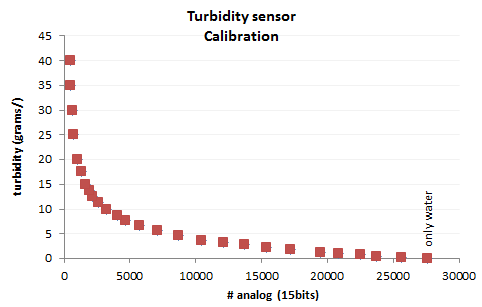

#### Additional notes for calibration accuracy and repeatability

- For each new turbidity being calibrated, it is always recommended to do an average of the recorded values. 
- Ensure that the probe (emitter and receiver) are submersed, and there are no air bubbles between them. Air bubbles influence strongly the readings. 
- Avoid direct sunlight on the turbidity probe during the calibration process. Direct sunlight is likely to alter readings. 
- The ambient light, water temperature and environment conditions (temperature, light and humidity) should be similar to those during the actual tests.
- If **analog#** is obtained automatically, the interval between readings is the one defined in [General settings](https://github.com/Ricardosgeral/relier/blob/master/README.md#general-settings-page) page.

## 7. Data collection
The *acquisition system box* handles the sensors and gets the data from them.  
The location where data will be collected is defined  by the user, and depends
on whether an internet connection is available, and whether a USB drive is plugged in.

### 7.1. No internet connection

Data is only saved locally in the *CSV* format and has two possible ways to go:
  
1. *No USB drive* is plugged in  >>
   Data are saved *only* on the micro SD card, inside folder **/srv/EROSTESTS**. 

2. A *USB is plugged in* >>
   Data are saved *only* on the **USB_root_directory**. 

#### Additional notes

- The name of the *CSV* file is defined by the user, either using:
   + the *touchscreen GUI*, in **General settings** page, or  
   + the *inputs.ini* file, modifying the parameter *filename*.
- Before removing a USB drive or the micro SD card it is ***strongly*** recommended to gently shutdown the *Raspberry Pi*, 
and unplug the power supply.
This will prevent corruption of the micro SD card and of the USB drive, and increase their life span. 
To silently disconnect the server you can either:
   + hold the *red pushbutton* in the back of the *acquisition system box* for more than *3 seconds* (if holden between 1 and 3 seconds, 
   the *Raspberry Pi* will reboot), or 
   + `$ sudo halt` in a *SSH* terminal session.
- If more than one USB drive is plugged in (not recommended !), data will be saved in the *first drive* being found.
- Data in the *CSV* files is ***never deleted*** automatically. If a file with the same name already exists in the USB drive or 
in the micro SD card, data is saved in the file but placed below the last row already there. This means that multiple tests may be collected 
in the same file (not desirable). It is preferable to set each test in an individual file.


### 7.2. Internet connection available (Ethernet or WiFi)

Data collection is also saved locally in *CSV* format. 
That is, if a USB drive is plugged in, data is saved to the USB drive, otherwise, data is saved to the server micro SD card.

However, ***in addition***, it is possible to send data to [Google Sheets](https://www.google.com/sheets/about/), if a valid 
*service_creds.json* file is provided (see instructions in *Software installation > server sofrware*).

#### How to enable 'Google Sheets'
1.  Select that option:
   - In the *touchscreen GUI* > *Settings* > activate the (only) checkbox, or
   - In *inputs.ini* file > ensure that *google_sheets = yes*.
   
2. Provide names for the *Spreadsheet* and for the *Worksheet*:
   - In the *touchscreen GUI* > *Settings*  > *Spreadsheet* (*Worksheet* name = *CSV filename*), or
   - In *inputs.ini* file > Spreadsheet name = *googlesh*, and Worksheet name = *filename*.

3. Provide a valid email, since a link to access the spreadsheet will be shared via email at the start of the test.
   - In the *touchscreen GUI* > *Settings* > Add email, or
   - In *inputs.ini* file > use parameter *share_email*.

#### Additional notes

- If the *Spreadsheet/Worksheet* provided by the user already exists, the data that was in that worksheet will be *deleted* (***Attention***). 
However, when a new Worksheet name is provided in an already existing Spreadsheet, a new sheet is added. 
This means that you can have a single Spreadsheet with different tests organized in different Worksheets (preferable).
- If there is no internet connection, data will not be, of course, sent to Google Sheets, 
even if you select the Google Sheets checkbutton (***Attention***). For debugging please see the 
[troubleshooting](https://github.com/Ricardosgeral/relier#troubleshooting) section. 
- If internet connection is lost during a test, the software will raise an exception and stop recording data to Google Sheets, 
but it will continue to record data locally (USB drive or micro SD card).
- Please be aware that, by choosing the 'Google Sheets' feature, the interval between readings chosen by the user 
will be increased a couple of seconds, due to the time required to request access the Google API. 
If you need an interval between readings smaller than 8 seconds, or you require an always constant interval between readings, 
please disable the 'Google Sheets' feature.
 

## 8. Achievements and reuse of *Python code*

- Use of the [*ADS1115*](https://www.adafruit.com/product/1085) *Analog to Digital Conversor (ADC)*, to acquire the analog outputs of the pressure sensors and turbidity sensor.
If you want to use another ADC (e.g., the [MCP3008 (10 bits)](https://www.adafruit.com/product/856), 
which is faster but less precise), the Python library will need, of course, to be replaced and the python code should be adapted.
- Use of the [*pigpio library*](http://abyz.me.uk/rpi/pigpio/) to get the readings from the turbine flowmeter (hall-effect sensor), using the function [callback](http://abyz.me.uk/rpi/pigpio/python.html#callback). 
More information [here](https://www.raspberrypi.org/forums/viewtopic.php?t=66445).
- *Use of threading (['thread-based parallelism'](https://docs.python.org/3/library/threading.html)), together with [Event objects](https://docs.python.org/3/library/threading.html#event-objects), in Python 3*. 
Threads are used in this project in three cases: 
   + In the handling of the results from *analog sensors*, for data 'stability'. Threads allow to do a mean over a certain period of time 
   with a shorter delay between samples. This can in some cases improve the data reliability. Thus, 
   the collection of readings from the ADC (ADS1115) is done using a [Thread Class object](https://docs.python.org/3/library/threading.html#thread-objects).   
   + Since *temperature sensors* take some time between reads (about 1 second), 
   the readings of those sensors is done in multi-tasking. 
   This ensures that the interval between readings is the one indicated by the user. 
   Treads are here also used as *Class objects*.
   + Detection of *serial communication* between the server and the Nextion touchscreen. 
   The server needs to check if the touchscreen is pressed, independently of being at the same time doing other tasks. 
   To achieve this it is used *Thread*, alongside with *Event*, both from the threading module. This achievement took me a while to master, and I believe it may be useful to others.
- *Use of Multiprocessing* (['Process-based parallelism'](https://docs.python.org/3/library/multiprocessing.html)). 
Multiprocessing is used to acquire data from the Eletromagnetic flowmeter via serial USB communication. [Value](https://docs.python.org/3/library/multiprocessing.html#multiprocessing.Value) method uses Shared memory to pass values between processes.
- Implementation of a [Ring buffer](https://www.oreilly.com/library/view/python-cookbook/0596001673/ch05s19.html), to avoid overflow of readings coming from the ADC chip.
- *Library for serial communication with the Nextion device in Python 3* (TX-RX, UART protocol). 
Unfortunately, until the day I'm writing this, a Python library to use Nextion touchscreen was not available.
There is a good library developed for Arduino, but I did not want to mix Python and *C* code. 
So, I've developed my own Nextion Library for Python 3 (which took me a while to achieve !).
This library is relatively simple to use, and has margin for improvement. 
You just need to look at the [*py3nextion_lib.py*](https://github.com/Ricardosgeral/relier/blob/master/py3nextion_lib.py),
and use it alongside with [*nextionApp.py*](https://github.com/Ricardosgeral/relier/blob/master/nextionApp.py) 
that has all the components (to be accessed by the server) defined in the Nextion Editor. 
Function *detect_touch()* in [main.py](https://github.com/Ricardosgeral/relier/blob/master/main.py)
is responsible for the continuous listening of the Nextion return bits, and the execution of for the following actions.
Of course, you need to know how to use the Nextion commands.
For that, see the [*instructions set*](https://nextion.itead.cc/resources/documents/instruction-set/).
- Use of the library [*pygsheets*](https://github.com/nithinmurali/pygsheets), alongside with 
library [*pandas*](https://pandas.pydata.org/index.html), to collect data from multiple sensors and send them to Google Sheets.  
- Use the library [*CSV*](https://docs.python.org/3.6/library/csv.html) to write the data (as dictionary) in rows.
- Use of the library [*configparser*](https://docs.python.org/3/library/configparser.html) to have a *.ini* file 
with the inputs.
- Use of the library [pyserial](https://pythonhosted.org/pyserial/), to read from the TX/RX (communication with the Nextion) and USB serial ports (communication with the Eletromagnetic flowmeter).
- Automatic detection when USB drives are plugged-in (mounted) or removed (unmounted).
 This also implies writing two rules in file *99-local.rules*.
- Combined Restart / Shutdown Button for Raspberry Pi 
(using a [*systemd service*](https://wiki.debian.org/systemd)) more info see [shutdown_button](https://github.com/scruss/shutdown_button): 
   + *Reboot*: hold the button more than half second but less than 3 seconds. The LED blinks with blue color and then the RPi reboots. 
   + *Shutdown*: hold the button more than 3 seconds. The LED blinks with red color and then the RPi shutdowns.
   Note, that the Raspberry Pi is still powered. 
 You still need to unplug the micro USB cable, to power off the server. 
 To restart the server after a shutdown, just power up the server again.
- Detection of the local *IP address* of the server (if connected to the internet).
- Start a python script right after start up or reboot of the server (*Raspberry Pi*), 
using [*crontab*](https://debian-administration.org/article/56/Command_scheduling_with_cron).
- Enable IC2 and 1-wire GPIO in file */boot/config.txt*.
- Enable pins 14(TX) and 15(RX) to use UART serial connection (where Nextion device is connected).  


## 9. Troubleshooting
 
- The following warning is expected: *'grep: /dev/fd/63: No such file or directory'* at the end of 
`$ sudo ./raspbian-post-install.sh`. Ignore it.
- Don't forget to obtain and replace the content of the file [*service_creds.json*](https://github.com/Ricardosgeral/relier/blob/master/service_creds.json), 
as indicated [above](https://github.com/Ricardosgeral/relier/blob/master/README.md#server-software-raspberry-pi), 
or the " Export to Google Sheets" feature will not work!
- The inspection of the **cronlog** file (`$ sudo nano /home/pi/relier/logs/cronlog`) may be helpful for detecting 
any eventual bugs during the software installation process, or during start up of the server, for example, 
to check if the Google credentials are correct!.
- *'Problem: Google signed Credentials'*. In this case, confirm that you have an internet connection,
and that you followed all 6 steps in installation of the server software. Don't forget to enable the 'Drive API' (step 4).
- If the Nextion touchscreen is not functioning properly or not working at all:
  + first, see the connections, in particular check that: RX (server) <-> TX (screen), and TX (server) <-> RX (screen); 
  + second, confirm that the baudrate is correct. By default nextion comes with 9600, but in program it is defined as 38400. This means that in first time
  the nextion needs to be set to that baud rate using file *pynextion_lib.py*.
  + third, ensure that *serial* is disconnected: `$ sudo raspi-config` > *5* > *P6 Serial* > *No*;
  + last, doing `$ ls -l /dev | grep serial` you should see *serial 0 >> ttyAMA0* (pins 14/15 in UART) and 
  *serial 1 >> ttyS0* (bluetooth in miniuart). By default UART is attributed to Bluetooth and miniuart to pins 14/15 (which has limitations). 
  That's why they are changed during the execution of 
  [*raspbian-post-install.sh*](https://github.com/Ricardosgeral/relier/blob/master/bash/raspbian-post-install.sh).
- To check if the *Analog-to-Digital Converter* (ADC - ADS1115 chip) and BME280 are properly connected via I2C, you can do 
*`$ sudo i2cdetect -y 1`*. 
 You should see a matrix with number ***48*** (ADS 1x15) and number ***76*** (BME280). 
 Otherwise, something is not connected correctly, or I2C protocol has not been enabled 
 (again, the bash file [*raspbian-post-install.sh*](https://github.com/Ricardosgeral/relier/blob/master/bash/raspbian-post-install.sh) should have done that !).
- If you want to check if the Linux service units running on reboot/shutdown are active, check their status.
 ```
 $ sudo systemctl status rcshut
 $ sudo systemctl status shutdown_button
 ```   
   `Ctr + D ` to leave the terminal.
- If you, by any reason (e.g., for debugging), need to stop all the python scripts that are running from startup of the server, 
open a terminal and execute:
 ```
 $ sudo pkill -9 python
 ```


## 10.  About the author and the *relier* project
I'm a Civil Engineer, with a [master degree](https://www.researchgate.net/publication/273715929_Enquadramento_das_analises_de_riscos_em_Geotecnia) 
in risk analysis in Geotechnical Engineering, and a [PhD](https://www.researchgate.net/publication/265396445_Experimental_investigation_on_limitation_of_the_progression_of_internal_erosion_in_zoned_dams?_sg=TYpuvUDlOEmsy1nkmycUNZZQmLHo34eFR1un5kQBsel1Ih6m8itcptNphw4q33ZLbFPsnKm5uX3PfaJmW1fljV7_goXnxDN4Ne4RwewR.OOCKioxBNPJoOd0B8BiFk4-Dqk849OZdMI_lxDR_IRduPQ88ovShdBBoVm34ZNhMTA_UT3M8PANv1KdYr7rMXg) 
on internal erosion in embankment dams.
 
Carrying out the [laboratory tests on internal erosion in soils](https://www.researchgate.net/publication/317742058_Limitation_of_the_progression_of_internal_erosion_in_zoned_dams), 
developed in my PhD, 
requires to simultaneously collect different types of measurements (water pressures, flow rate, temperature, turbidity, ...).
The measurements had to be registered by hand, in regular intervals, by two operators!! 
Such manual process is tedious and prone to errors.

So, I've decided to invest time developing a 'low budget' acquisition system (hardware and software) that could 
collect data automatically from multiple analog and digital output sensors. 
*relier* born this way!

Please note that I'm not an expert in informatics, in computing, nor in electronics.
I define myself as an enthusiastic self learner. 
All shown here was developed from my own research, mainly on forums, Github and other websites.
Thus, it is possible that some things (code, connections, methods...) could be optimized, or done in a different or a better way. 
Yet, ***relier*** *acquisition system* performs as intended.
You can report bugs, suggest enhancements, or even fork the project on [Github](https://github.com/Ricardosgeral/relier). 
All contributions are welcome.

## 11. Acknowledgements
My thanks to *António Timóteo* (LNEC-DG technician) for his work on cutting the openings in the acquisition aluminium box. 
Also, my thanks to *João Paixão* (LNEC-CIC technician) for soldering the smaller and more difficult parts 
(cup terminals of the mini aviator plugs and the pines in the ADC and of the level shifter).


## 12. License
Copyright (c) 2019 Ricardo Correia dos Santos

See the [license conditions](https://github.com/Ricardosgeral/relier/blob/master/LICENSE).