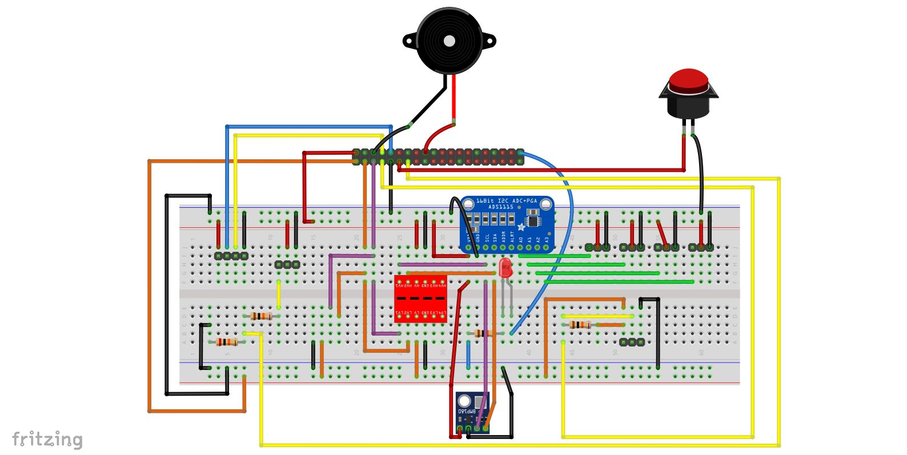
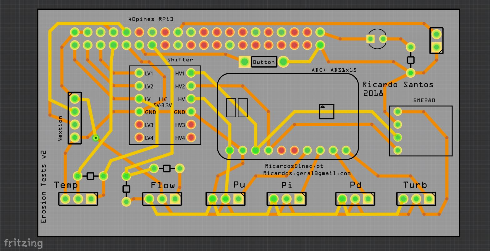

# *erosLab* 
# Laboratory Erosion Test Software 
Open design of a monitoring acquisition system of a laboratory erosion test apparatus, using raspberry pi3 B as server, and python3 code. 

This work has been done by **Ricardo Correia dos Santos** at [Laboratório Nacional de Engenharia Civil (LNEC)](www.lnec.pt/en/), in Lisbon, Portugal.

## Is this for me ?

You just need to have some DIY skills, for scrapping some materials, figuring out 
how to assemble some things together and figuring out how some components work. The 
instructions given here should also be taken more like guidelines based on what 
I could do with the materials I had. If you do not have the exact same 
sensors/components, they'll surely work a little different, but as they should do the same 
things, there will be similarities too. 

Feel free to contact me if you manage to get it working with different components, 
so these instructions can be improved and be more helpful. 

# Software

## Usage/install
These instructions should be carried out after a fresh installation of raspbian (tested with [2018-04-18-raspian-stretch](http://downloads.raspberrypi.org/raspbian/images/raspbian-2018-04-19/)). 

**NOTE:** If no monitor is available (headless raspberry pi 3), first you have to do these 4 steps.
1. Create an empty file (in windows use notepad - in Linux terminal use command *touch* - in Mac use TextEdit).
2. Save the file with name: ssh (ssh.txt should also work).
3. Copy or move the ssh file into the root of the sd card.
4. Put the SD card in RPi3B and power it on.

Connect to raspberry pi directly (if monitor is available) or via SSH (for example with putty). In this last option, you need to know the IP of the raspberry pi!

It is recommended to change the password of user pi, since SSH is enabled!

    $ passwd 
    
   **Login**: *pi*
   
   **Password**: *raspberry*

In a terminal, run the following sequential commands:
    
    $ cd /tmp && wget https://raw.githubusercontent.com/Ricardosgeral/erosLab/master/bash/raspbian-post-install.sh
    $ sudo chmod +x raspbian-post-install.sh
    $ sed -i 's/\r//' raspbian-post-install.sh
    $ sudo ./raspbian-post-install.sh

Next, you need to create your own JSON file with the google credentials
To obtain it, see https://pygsheets.readthedocs.io/en/latest/authorizing.html#signed-credentials

    $ sudo nano /home/pi/erosLab/service_creds.json
    
Then, delete all content of the file and past your own credentials. Ctrl+X, yes and Enter to save file.

    $ sudo reboot

And that's it, after reboot the _Raspberry PI_ server should be running properly (if hardware is also set correctly)!

# Hardware

## Microprocessor specs and components

+ 1x [**Raspberry Pi 3 model B**](https://www.raspberrypi.org/products/raspberry-pi-3-model-b/) [35€]
+ 1x [Micro SD card](https://www.aliexpress.com/item/SAMSUNG-Micro-SD-Card-256G-128GB-64gb-32g-100M-s-Class10-U3-4K-UHD-Memory-card/32813615707.html?spm=a2g0s.9042311.0.0.Xdt3Ob) [12 €]
+ 1x [Raspberry Pi Universal Power Supply](https://www.raspberrypi.org/products/raspberry-pi-universal-power-supply/) [15€]
+ 1x [Raspberry Pi GPIO 40 pin cable](https://www.aliexpress.com/item/Raspberry-pi-B-raspberry-PI-GPIO-40-pin-cable/32809594049.html?spm=2114.search0104.8.35.5790121bpoCIAu&transAbTest=ae803_2&priceBeautifyAB=0) [3€]
+ 1x [Raspberry Pi case](https://www.aliexpress.com/item/Best-Selling-Clear-Case-for-Raspberry-Pi-3-Model-B-Clear-by-SB-Components-Plastic-Protective/32738665641.html?spm=a2g0s.9042311.0.0.A8JBGc) [2€] (optional!)

## Acquisition system developed to read the sensors

+ 1x PCB with 2 layers (details of the PCB are detailed below) [12 €]
+ 1x [**Nextion screen 2.8"** - NX3224T028](https://nextion.itead.cc/shop-nextion/) [15 €]
+ 1x [**16 Bit I2C ADS1115** Module ADC 4 channel with Pro Gain Amplifier](https://www.aliexpress.com/item/16-Bit-I2C-ADS1115-Module-ADC-4-channel-with-Pro-Gain-Amplifier-RPi-1PCS/32817162654.html?spm=a2g0s.9042311.0.0.KZKf8O) [2€]
+ 1x [**Logic Level Shifter** Bi-Directional 5V to 3.3V](https://www.aliexpress.com/item/5PCS-Logic-Level-Shifter-Bi-Directional-For-Arduino-5V-to-3-3V-Four-Way-Two-Way/32827270848.html?spm=a2g0s.9042311.0.0.PRV9iC) [2€]
+ 1x [88x38x100mm aluminum box profile with enclosure for PCB](https://www.aliexpress.com/item/Free-shipping88-38-100mm-width-x-high-x-length-aluminum-extrusion-box-profile-enclosure-for-PCB/32800855972.html?spm=a2g0s.9042311.0.0.Wvmz38) [6€]
+ 6x [XH2.54 3-Pins connectors with right angle Male for PCB - Header+Housing+Terminal](https://www.aliexpress.com/item/XH2-54-2P-3P-4P-5P-6P-7P-8P-9P-10P-11P-12P-13P-14P-15P/32793262315.html?spm=a2g0s.9042311.0.0.DEz5gr) [3€]
+ 1x [2.54mm 2x20 DC3 40 Pin Right Angle Male for PCB](https://www.aliexpress.com/item/10pcs-2-54mm-2x20-DC3-40-Pin-Right-Angle-Male-Shrouded-PCB-IDC-Socket-Box-header/32597308721.html?spm=a2g0s.9042311.0.0.y1HFgb) [4€]
+ 6x [8mm Male & Female Connector miniature Aviation Plug M8 Circular Socket+Plug](https://www.aliexpress.com/item/1PCS-AP049-YC8-2-3-4-5-6-7Pin-8mm-Male-Female-Connector-miniature-Aviation-Plug/32845374887.html?spm=a2g0s.9042311.0.0.6sphAY) [6x4=24€]
+ 1x [Momentary pushbutton switches 3A Reset Button](https://www.aliexpress.com/item/10pcs-Momentary-Push-Button-Switch-12mm-Momentary-pushbutton-switches-3A-125VAC-1-5A-250VAC-Reset-Button/32802331189.html?spm=a2g0s.9042311.0.0.1PWJGq) [2€]
+ 1x 3mm LED [<1€]
+ 1x Active Buzzer Alarm 5V  [<1€]
+ 3x 10kΩ carbon film resistor 1x 20kΩ carbon film resistor [<1€]
+ 1x 4 pins Male Single Row Pin Header Strip [<1€]
+ 6 x 4cm shielded cable with 3 wires [<1€]

## Printed circuit board (PCB) produced
The 2 layer's PCB was developed using [Fritzing](fritzing.org/), and the production files and fzz file are presented [here](https://github.com/Ricardosgeral/erosLab/tree/master/Fritzing). The PCB was printed by [PCBWay company](https://www.pcbway.com/).

**Breadboard view**

**PCB view**

**Look of the PCB top layer**

**Look of the PCB Bottom Layer**

## Sensors

The following **'low cost' sensors** were used:
+ 3x [**Pressure Transducer Transmitter Sensor**, 0-5psi 5V](https://www.aliexpress.com/item/1Pc-Pressure-Transducer-Sender-Stainless-Steel-for-Oil-Fuel-Air-Water-5psi-CSL2017/32814346612.html?spm=2114.search0104.3.34.61855791WWOsT5&ws_ab_test=searchweb0_0,searchweb201602_1_10152_10151_10065_10344_10068_10342_10343_5722611_10340_10341_10698_10696_5722911_5722811_10084_5722711_10083_10618_10304_10307_10301_5711211_10059_308_100031_10103_10624_10623_10622_10621_10620_5711311_5722511,searchweb201603_32,ppcSwitch_5&algo_expid=a59a0ef4-feff-4b1a-b341-8883ad49d5dc-5&algo_pvid=a59a0ef4-feff-4b1a-b341-8883ad49d5dc&transAbTest=ae803_2&priceBeautifyAB=0) [3x13=39€]
+ 1x [**Turbine flow sensor**, 1.5" DN40 2~200L/min water Plastic Hall ](https://www.aliexpress.com/item/1-5-DN40-2-200L-min-water-Plastic-Hall-Turbine-flow-sensor-industry-meter/32445746581.html?spm=a2g0s.9042311.0.0.lPAUbg) [13€]
+ 1x [**Analog Turbidity Sensor**, 5V 40mA](https://www.aliexpress.com/item/DFRobot-Gravity-Analog-Digital-Turbidity-Sensor-5V-40mA-DC-support-both-signal-output-compatible-with-arduino/32595773560.html?spm=a2g0s.9042311.0.0.dGtxdp) [9€]
+ 1x [Waterproof DS18B20 digital temperature sensor (probe)](https://www.aliexpress.com/snapshot/0.html?spm=a2g0s.9042311.0.0.oXghXt&orderId=505161631680030&productId=32675444739) [<1€]
+ 1x [BME280 Digital Sensor, Humidity Temperature and Barometric Pressure Sensor](https://www.aliexpress.com/item/3In1-BME280-GY-BME280-Digital-Sensor-SPI-I2C-Humidity-Temperature-and-Barometric-Pressure-Sensor-Module-1/32659765502.html?spm=a2g0s.9042311.0.0.oXghXt) [3€]

Majority of the sensors are connected to the Acquisition system box via mini aviator plugs. Exception is the *BME280* that is soldered directly in the PCB.

## Other components that may be useful
+ Breadboard(s)
+ [T-cobbler for raspberry pi](https://www.aliexpress.com/item/830-tie-points-MB102-breadboard-40Pin-Rainbow-Cable-GPIO-T-Cobbler-Plus-Breakout-Board-Kit-for/32673580640.html?spm=2114.search0104.3.9.6581309ai8NJdY&ws_ab_test=searchweb0_0,searchweb201602_1_10152_10151_10065_10344_10068_10342_10343_5722611_10340_10341_10698_10696_5722911_5722811_10084_5722711_10083_10618_10304_10307_10301_5711211_10059_308_100031_10103_10624_10623_10622_10621_10620_5711311_5722511,searchweb201603_32,ppcSwitch_5&algo_expid=3ed88c37-67f1-4fe2-a688-b3983db90ff7-1&algo_pvid=3ed88c37-67f1-4fe2-a688-b3983db90ff7&transAbTest=ae803_2&priceBeautifyAB=0)
+ DuPont jumper wires
+ Micro SD adapter

## Additional tools required for the assemblage of the PCB and acquisition system
+ Cable Wire Stripper Crimping Plier
+ Soldering iron + sold
+ Tools to make the openings in the aluminum box (*e.g.* a mini Drill DIY set should be enough) 
+ Precision screwdriver set

## Troubleshooting
 - The following error/warning is expected: 'grep: /dev/fd/63: No such file or directory' at the end of $ sudo ./raspbian-post-install.sh
 - Don't forget to obtain and replace the file **service_creds.json**, as indicated above, or the program will not start!
 
 